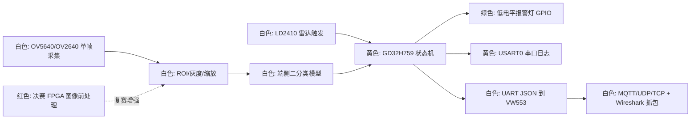

# EdgeCare 项目看板

更新时间：2026-06-14

## 本轮更新记录

- 2026-06-14：将当前可用相机 fallback 版准备提交并推送到 GitHub。当前默认配置保持 `OV5640_JPEG_TO_YUV_REF + DCI rising + EDGECARE_ENABLE_GRAY96_LSHIFT2_COMPENSATION=1`，正常固件 `EDGECARE_ENABLE_GRAY96_DUMP=0U`，数据集采集时再临时打开 dump。该版本可用于明天先做小规模 `empty/safe/intrusion` 数据集启动版；相机根因仍未闭环，继续记录为 DVP 数据位映射/byte-scale 或 D0/D1/D4 物理位线异常方向。提交前验证命令为 `powershell -ExecutionPolicy Bypass -File .\tools\verify_edgecare.ps1 -SkipSafetyScan`，结果包含 Keil 构建 `Code=22990 RO-data=6498 RW-data=8 ZI-data=167000`、`0 Error(s), 0 Warning(s)`。
- 2026-06-13：完成本轮“修好相机并准备采集数据集”的阶段性收敛，但不把它表述为相机根因已修复。当前默认仍是 `OV5640_JPEG_TO_YUV_REF + DCI rising + EDGECARE_ENABLE_GRAY96_LSHIFT2_COMPENSATION=1`：可输出可辨认真实场景灰度图，适合先启动小规模 MVP 数据集采集；但 raw Y 仍约 `2..49`，根因继续指向 DVP 数据位映射/byte-scale 或已知 D0/D1/D4 物理位线异常。新增并实测只读窗口诊断，`.embeddedskills/logs/serial/edgecare_reset_capture_20260613_225918.log` 显示 `camera_window_readback ... output=320x240 inc=0x31,0x31`，随后 `camera_capture[normal_jpeg_to_yuv_ref]: dma=done words=38400 remain=0 checksum=0xE83E2040`，`preprocess_gray96 ... scale=lshift2 ... min=8 max=192 mean=92`；对应 RAM frame 为 `data/photo_evidence_jpeg_to_yuv_ref/edgecare_jpeg_to_yuv_ref_window_readback_frame_20260613_225918.bin`，解码目录为 `data/photo_evidence_jpeg_to_yuv_ref/decoded_20260613_225918_window_readback/`。`0x3800..0x3815` 简单输出窗口错误基本排除。已更新 `doc/EdgeCare_Data_Collection.md`：采集时临时打开 `EDGECARE_ENABLE_GRAY96_DUMP=1U`，采 `jpeg_to_yuv_ref_y02`，类别为 `empty/safe/intrusion`，先每类 20 张并人工预览 BMP；正常演示固件保持 dump 关闭。新增 `tools/test_collect_gray96_serial.py` 并接入 `tools/verify_edgecare.ps1`，验证当前 `image_dump_begin kind=gray96 variant=jpeg_to_yuv_ref_y02` 和 `byte_plane` 诊断解析落盘逻辑。
- 2026-06-13：完成当前短期目标：在 `OV5640_JPEG_TO_YUV_REF + DCI rising` baseline 上验证并固化可回退的 `gray96` 左移 2 位临时 MVP 输入补偿。新增默认开启 `EDGECARE_ENABLE_GRAY96_LSHIFT2_COMPENSATION=1`，仅作用于 YUV422 -> `gray96` 预处理路径；`value>63` 饱和到 `255`，否则 `value<<2`，并在启动 probe 日志显式输出 `scale=lshift2`，避免把它误认为相机根因修复。已给 `tools/decode_camera_frame.py` 增加离线 `gray96_y02/y13_96x96` 与 `gray96_y02/y13_lshift2_96x96` 模型输入候选，并补静态测试。验证：`tools/verify_edgecare.ps1 -SkipSafetyScan` 通过，Keil 构建 `Code=22142 RO-data=6086 RW-data=8 ZI-data=167000`、`0 Error(s), 0 Warning(s)`；J-Link 以 `GD32H759IMT6`、`100 kHz` 烧录成功。实机串口 `.embeddedskills/logs/serial/edgecare_reset_capture_20260613_221540.log` 确认 `camera_capture[normal_jpeg_to_yuv_ref]: dma=done words=38400 remain=0 checksum=0x8E5B0421`，随后 `preprocess_gray96: source=OV5640_JPEG_TO_YUV_REF_Y02 scale=lshift2 ... min=8 max=192 mean=93 checksum=0x683CDABA`。对应 RAM frame 保存为 `data/photo_evidence_jpeg_to_yuv_ref/edgecare_jpeg_to_yuv_ref_lshift2_frame_20260613_221540.bin`，前 16 字节 `0B 1F 09 20 07 1E 09 20 ...` 与串口 `first=20091F0B,20091E07...` 小端匹配；解码目录为 `data/photo_evidence_jpeg_to_yuv_ref/decoded_20260613_221540_lshift2/`。同一帧离线对比：`gray96_y02_96x96` 为 `min=2 max=48 mean=23`，`gray96_y02_lshift2_96x96` 为 `min=8 max=192 mean=93`，视觉上 96x96 输入明显更可读。结论：保留该补偿作为临时 MVP 模型输入；相机低位宽/位映射根因仍未修复，下一步转 DVP 数据位映射、输出 bit-width/byte-scale 和 `0x3800..0x3815` 输出窗口/活动行相位排查。
- 2026-06-13：继续排查 `OV5640_JPEG_TO_YUV_REF` 真实图像低亮度/低位宽问题。先给 `tools/decode_camera_frame.py` 增加 `lshift2` 离线诊断候选，并补静态测试；对 `baseline20_recheck` 统计显示 Y 相位约 `2..49 mean=26`，U/V 相位约 `31`，左移 2 位后 Y 约 `8..196`、U/V 约 `124`，说明更像数据位宽/位映射问题而不是单纯 YUV 顺序。随后做单变量实机候选 `EDGECARE_CAMERA_JPEG_TO_YUV_FORCE_8BIT_DVP=1`，在 JPEG-to-YUV normal path 写 `0x3034=0x18` 并打印 PLL 回读；构建 `0 Error(s), 0 Warning(s)` 后烧录，串口 `.embeddedskills/logs/serial/edgecare_reset_capture_20260613_213104.log` 确认 `3034=0x18 3035=0x21 3036=0x46 3037=0x13` 且 `dma=done`，保存帧 `data/photo_evidence_jpeg_to_yuv_ref/edgecare_jpeg_to_yuv_ref_force_8bit3034_frame_20260613_213104.bin`，解码到 `data/photo_evidence_jpeg_to_yuv_ref/decoded_20260613_213104_force_8bit3034/`。结果：Y 相位仍只有 `2..44 mean=20/21`，U/V 仍约 `31`，未恢复正常 8-bit 值域，因此 `0x3034=0x18` 已排除为默认修复。最终已把 `EDGECARE_CAMERA_JPEG_TO_YUV_FORCE_8BIT_DVP` 恢复为 `0`，重新构建 `0 Error(s), 0 Warning(s)`、烧回板子，确认日志 `.embeddedskills/logs/serial/edgecare_reset_capture_20260613_213715.log` 读回 `3034=0x1A`、`3824=0x04`、`460b=0x37`、`460c=0x20`、`4740=0x20`、`4745=0x02`、DCI rising、`dma=done`。下一步不要重复测 `0x3034=0x18`，转向 DVP 数据位映射、`0x3800..0x3815` 输出窗口/活动行相位，以及固件侧 gray96 左移 2 位补偿是否可作为 MVP 临时输入补偿。
- 2026-06-13：继续沿 `OV5640_JPEG_TO_YUV_REF + 0x4740=0x20 + DCI rising` 排查真实图像质量，完成两组 VFIFO/PCLK 单变量 A/B 并排除。新增但默认关闭 `EDGECARE_CAMERA_JPEG_TO_YUV_VFIFO_REF_CANDIDATE` 与 `EDGECARE_CAMERA_JPEG_TO_YUV_PCLKDIV08_CANDIDATE`，并在 `tools/test_camera_sync_diag_static.py` 增加默认值保护。实测 `460B=0x35,460C=0x22,3824=0x04`：日志 `.embeddedskills/logs/serial/edgecare_reset_capture_20260613_205729.log`，帧 `data/photo_evidence_jpeg_to_yuv_ref/edgecare_jpeg_to_yuv_ref_vfifo_ref_candidate_frame_20260613_205753.bin`，同场景回测解码 `data/photo_evidence_jpeg_to_yuv_ref/decoded_20260613_210331_vfifo_ref_candidate_recheck/`；实测 `460B=0x37,460C=0x20,3824=0x08`：日志 `.embeddedskills/logs/serial/edgecare_reset_capture_20260613_210739.log`，帧 `data/photo_evidence_jpeg_to_yuv_ref/edgecare_jpeg_to_yuv_ref_pclkdiv08_candidate_frame_20260613_210803.bin`，解码 `data/photo_evidence_jpeg_to_yuv_ref/decoded_20260613_210803_pclkdiv08_candidate/`。两者与基线回测 `data/photo_evidence_jpeg_to_yuv_ref/decoded_20260613_210100_baseline20_recheck/` 视觉和指标基本一致，不能作为默认改善。最终已烧录回默认基线，`.embeddedskills/logs/serial/edgecare_reset_capture_20260613_211008.log` 确认 normal 读回 `3824=0x04 460b=0x37 460c=0x20`、`dci=pclk_rising_hs_blank_low_vs_blank_high`、`dma=done`；`tools/verify_edgecare.ps1 -SkipSafetyScan` 通过，Keil 构建 `0 Error(s), 0 Warning(s)`，程序大小 `Code=21998 RO-data=5994 RW-data=8 ZI-data=167000`。下一步不再优先查曝光、`0x4745`、`0x460B/0x460C/0x3824` 单点，转向输出窗口/活动行相位 `0x3800..0x3815` 和 YUV/颜色解释。
- 2026-06-13：完成 JPEG-to-YUV 新基线收敛。手动曝光 `3503=0x07 exp=0x0375 gain=0x02A` 已实测更暗更差，证据为 `.embeddedskills/logs/serial/edgecare_reset_capture_20260613_202337.log` 和 `data/photo_evidence_jpeg_to_yuv_ref/decoded_20260613_202337_manual_exp0375_gain02a/`，默认保持 `EDGECARE_CAMERA_JPEG_TO_YUV_MANUAL_EXPOSURE=0`。`0x4745` data-order raw-PCLK sweep 也已实测无效，证据为 `.embeddedskills/logs/serial/edgecare_reset_capture_20260613_203147.log`，默认保持 `EDGECARE_ENABLE_CAMERA_DATA_ORDER_SOURCE_SWEEP=0`。随后单变量测试 DCI PCLK rising：保持 OV5640 `0x4740=0x20`、`0x4745=0x02`、自动曝光不变，仅把 GD32 DCI 采样边沿从 falling 改为 rising；串口 `.embeddedskills/logs/serial/edgecare_reset_capture_20260613_204732.log` 确认 `camera_capture_normal ... dci=pclk_rising_hs_blank_low_vs_blank_high`，帧 `data/photo_evidence_jpeg_to_yuv_ref/edgecare_jpeg_to_yuv_ref_rising_default_frame_20260613_204756.bin` 解码到 `data/photo_evidence_jpeg_to_yuv_ref/decoded_20260613_204756_rising_default/`，目视横向条纹显著减少，真实文字/物体更清楚。当前默认固件为 `EDGECARE_CAMERA_JPEG_TO_YUV_DCI_RISING=1`，`tools/verify_edgecare.ps1 -SkipSafetyScan` 通过，Keil 构建 `0 Error(s), 0 Warning(s)`，程序大小 `Code=21998 RO-data=5994 RW-data=8 ZI-data=167000`。下一步不再优先查曝光和 `0x4745`，转向 VFIFO/窗口/行打包、活动行对齐和 YUV/颜色顺序。
- 2026-06-13：`0x4740=0x20` 基线回退后已完成验证、烧录和实机串口确认。`powershell -ExecutionPolicy Bypass -File .\tools\verify_edgecare.ps1 -SkipSafetyScan` 通过，Keil 构建 `0 Error(s), 0 Warning(s)`，程序大小 `Code=21998 RO-data=5994 RW-data=8 ZI-data=167000`；随后用 `tools/jlink_flash_edgecare.ps1 -Flash -Device GD32H759IMT6 -SpeedKHz 100 -TimeoutSec 120` 烧录成功，J-Link 显示 `Programming flash`/`Verifying flash` 均 `Done` 且 `O.K.`。最新串口日志为 `.embeddedskills/logs/serial/edgecare_reset_capture_20260613_174849.log`，确认 `camera_capture_normal: source=OV5640_JPEG_TO_YUV_REF ... timing=471d00_474020`，`camera_isp_path_regs[normal_jpeg_to_yuv_ref] ... 4740=0x20`，`camera_capture[normal_jpeg_to_yuv_ref]: dma=done words=38400 remain=0 nonzero=38400 repeated=6688 checksum=0x46BBE724 ... dmaerr=000`，`preprocess_gray96 min=0 max=63 mean=24 checksum=0xB46075A4`。当前结论保持：可辨认真实灰度图路径已跑通，但仍是诊断质量，下一步在 `0x20` 基线上优化曝光/增益、横向条纹、窗口和 YUV/颜色顺序。
- 2026-06-13：已对真 `0x4740=0x24` 的 `href_gate24` 尝试完成实机证据闭环。先保存未复位 RAM 帧 `data/photo_evidence_jpeg_to_yuv_ref/edgecare_jpeg_to_yuv_ref_href_gate24_frame_20260613_173850.bin`，解码目录为 `data/photo_evidence_jpeg_to_yuv_ref/decoded_20260613_173850_href_gate24/`；串口日志 `.embeddedskills/logs/serial/edgecare_reset_capture_20260613_173850.log` 确认读回 `4740=0x24`，`camera_capture[normal_jpeg_to_yuv_ref]` 为 `dma=done words=38400 remain=0 nonzero=38400 repeated=7299 checksum=0xE1980260 ... score=259`，`preprocess_gray96 min=0 max=47 mean=30`。视觉对比后结论：`0x24` 仍能看到真实场景几何轮廓，但动态范围更窄、噪点更重，不如 `20260613_170316_clean` 的 `0x20` 基线；因此默认正常路径已回退为 `0x4740=0x20`，串口标记恢复 `timing=471d00_474020 note=photo_proof_candidate`，`EDGECARE_ENABLE_CAMERA_JPEG_TO_YUV_TUNE_SWEEP=0` 保持关闭。`tools/test_camera_sync_diag_static.py` 已新增静态约束，防止正常 JPEG-to-YUV 路径再次误钉到 `0x24`。
- 2026-06-13：`OV5640_JPEG_TO_YUV_REF` 路径首次取得可辨认真实场景灰度图像证据，问题已从“完全拍不出真实图”推进到“能看到真实物体轮廓/文字，但亮度低、动态范围窄、横向条纹明显，彩色/YUV 顺序仍未解决”。证据帧为 `data/photo_evidence_jpeg_to_yuv_ref/edgecare_jpeg_to_yuv_ref_frame_20260613_170316_clean.bin`，推荐预览为 `data/photo_evidence_jpeg_to_yuv_ref/decoded_20260613_170316_clean/raw_yuv422_yuyv_y_320x240_norm.bmp` 和 `raw_640x240_norm.bmp`；干净串口日志为 `.embeddedskills/logs/serial/edgecare_reset_capture_20260613_170316.log`，关键行 `camera_capture[normal_jpeg_to_yuv_ref]: dma=done words=38400 remain=0 nonzero=38400 repeated=5376 checksum=0x89D5289F ... dmaerr=000`。当前默认固件保留 `EDGECARE_CAMERA_NORMAL_OUTPUT_JPEG_TO_YUV_REF=1`，重型 wiring/source/output-mux/data-pad/DCI probe sweep 关闭，`EDGECARE_ENABLE_CAMERA_JPEG_TO_YUV_TUNE_SWEEP=0`；窄范围 sweep 已完成，其中 `href_gate24/0x4740=0x24` 视觉更差，未作为默认。EEWorld 链接在本环境被 `EEWORLD WAF` 拦截，尚不能引用其正文；下一步是在 `0x20` 基线上继续做曝光/增益/条纹和 YUV 顺序清理。
- 2026-06-13：继续排查“为什么不能拍出真实图像”，本轮不再随机动接线，聚焦 OV5640 输出源/ISP 路径。已把当前默认固件收敛为轻量证据构建：`EDGECARE_ENABLE_CAMERA_RAW_PCLK_SAMPLE=1`、`EDGECARE_ENABLE_CAMERA_PATTERN_SOURCE_SWEEP=1`、`EDGECARE_CAMERA_NORMAL_OUTPUT_RGB565=1`，重型 output mux/raw DCI/ISP path/data pad/DCI status sweep 保持关闭。源码修正 `camera_apply_rgb565_capture_path()` 使用 `4740=0x20`，与日志中的 `timing=471d00_474020` 和已验证的内部 DVP pattern 路径一致；`camera_pattern_source_sweep[...]` 现在每个候选都固定 `501F=0x00`、`471D=0x00`、`4740=0x20`，只比较 `ISP colorbar(503D=0x80,4741=0x00)`、`DVP pattern(503D=0x00,4741=0x05)`、`real scene(503D=0x00,4741=0x00)`；`camera_output_mux_capture()` 也固定同一 timing，避免前序实验污染。已同步更新 `doc/EdgeCare_Camera_Bringup_Notes.md` 和 `doc/EdgeCare_Codex_Handoff.md`。本轮尚未烧录，下一步需用户授权后烧录并抓 reset 日志，重点回传 `camera_pattern_source_sweep[...]`、`camera_raw_pclk_sample[...]`、`camera_capture[source_isp_colorbar/source_dvp_pattern/source_real_scene]`、`camera_rgb565_path_readback` 和 `camera_capture[normal_rgb565]`。
- 2026-06-13：新增授权后专用的一键证据链脚本 `tools/camera_photo_evidence_run.ps1`。脚本默认 dry-run，不会烧录/复位/读 RAM；只有显式 `-Flash` 才会依次调用 `jlink_flash_edgecare.ps1`、`jlink_reset_capture_serial.ps1`、`jlink_save_camera_frame.ps1` 和 `decode_camera_frame.py`，完成“烧录 -> reset 抓串口 -> J-Link 保存 153600B 帧 -> 灰度/Bayer 候选解码”。已把该脚本的 dry-run 安全门加入 `tools/test_jlink_scripts_static.py`，并验证 dry-run 只打印计划。`python -m py_compile` 与 `tools/verify_edgecare.ps1 -SkipSafetyScan` 均通过，Keil 构建 `0 Error(s), 0 Warning(s)`，程序大小 `Code=20902 RO-data=4194 RW-data=8 ZI-data=167000`。尚未烧录，仍等待用户明确授权。
- 2026-06-13：为避免把可用 RAW Bayer 帧误判成噪声，增强 `tools/decode_camera_frame.py`：现在除灰度/bitrev/stride/phase 候选外，还会对 `stride2` RAW 平面输出 `RGGB/GRBG/GBRG/BGGR` 最近邻 Bayer 彩色 BMP 预览，并把候选写入同一个 `summary.json`。已用旧真实场景 RAW8 帧 `data/photo_evidence_real_raw8/edgecare_real_raw8_frame_20260613_101207.bin` 离线重解码到 `data/photo_evidence_real_raw8/decoded_20260613_101207_bayer_check/`，`raw_stride2_phase0_320x240_rggb_rgb.bmp` 仍为彩色随机颗粒、无真实场景轮廓；因此“旧 RAW8 样张不是拍照成功”的判断成立。`python -m py_compile .\tools\decode_camera_frame.py` 通过。
- 2026-06-13：针对用户指出真实场景样张“像噪声、无法相信能够拍摄”，确认当前不能视为拍照成功。下一轮采用单变量诊断：模块丝印为 `PWON`，而此前固件按 `EDGECARE_CAMERA_PWON_ACTIVE_HIGH=0` 驱动，可能导致 SCCB/PCLK/内部 DVP 图案可用，但真实感光/ISP 路径未正常工作。已临时改为 `EDGECARE_CAMERA_PWON_ACTIVE_HIGH=1` 构建诊断固件；同时修正 `tools/test_camera_sync_diag_static.py` 中与当前源码结构不一致的静态断言。`tools/verify_edgecare.ps1 -SkipSafetyScan` 已通过，Keil 构建 `0 Error(s), 0 Warning(s)`，程序大小 `Code=20902 RO-data=4194 RW-data=8 ZI-data=167000`。尚未烧录；下一步需在用户确认后烧录、reset 抓串口，并用 J-Link 保存 RAM 帧解码，判断是否出现可辨认真实场景。
- 2026-06-13：复核用户对“样张像噪声”的质疑，确认此前不能称为“照片感成像成功”。代表性真实场景文件 `data/photo_evidence_real_raw8/edgecare_real_raw8_frame_20260613_101207.bin` 解码出的 `data/photo_evidence_real_raw8/decoded_20260613_101207/raw_stride2_phase0_160x240_norm.bmp` 为高频颗粒/噪声感图，无法辨认真实场景；代表性内部图案文件 `data/photo_evidence_dvp_pattern/edgecare_dvp_pattern_frame_20260613_093617.bin` 解码出的 `data/photo_evidence_dvp_pattern/decoded_20260613_093617/raw_320x240.bmp` 是规则竖条，说明 DVP/DCI/DMA 能搬运结构化数据，但不等于真实拍照。已同步更正 `doc/EdgeCare_Codex_Handoff.md` 和 `doc/EdgeCare_Camera_Bringup_Notes.md`：当前状态改为“RAW8 传输链路/内部图案证明通过；真实场景可辨认图像未通过；训练集采集暂停”。
- 2026-06-13：针对用户指出“RAW8 样张像噪声，无法证明能拍照”，执行了一轮照片感诊断。新增编译期开关 `EDGECARE_CAMERA_NORMAL_OUTPUT_ISP_YUV`，临时设为 `1`，并打开 `EDGECARE_ENABLE_GRAY96_DUMP/VARIANTS/BYTE_PLANE_DUMP` 与 full reference init，构建 `0 Error(s), 0 Warning(s)` 后烧录抓取 `.embeddedskills/logs/serial/edgecare_reset_capture_20260613_015043.log`。结果：`camera_capture[normal_isp_yuv422]` 虽 `dma=done words=38400 remain=0`，但整帧为常量 `0x02020202`，`repeated=38399`、`checksum=0x00000000`；两个 `gray96` 和四个 `byte_plane` dump 均为 `min=2 max=2 mean=2 checksum=0x00000000`，生成文件位于 `data/photo_diag_isp_yuv/`。结论：当前只证明 RAW8 运输链路可用，尚未得到照片感/可辨识画面；OV5640 ISP/YUV 路径仍未打通，不能把 RAW8 颗粒图作为“拍照成功”证据。已恢复默认配置 `EDGECARE_CAMERA_NORMAL_OUTPUT_ISP_YUV=0`、dump 关闭、minimal init，重新验证并烧录，短抓 `.embeddedskills/logs/serial/edgecare_reset_capture_20260613_015454.log` 确认回到 RAW8 `dma=done` 轻量输出。
- 2026-06-13：按用户要求抓取一张 OV5640 当前 RAW8 主线样张。临时打开 `EDGECARE_ENABLE_GRAY96_DUMP=1` 后验证通过并烧录，J-Link reset 后抓取 `.embeddedskills/logs/serial/edgecare_reset_capture_20260613_013458.log`，串口包含完整 `image_dump_begin/data/end`，`preprocess_gray96` 校验为 `checksum=0x78851C9F`、`min=0 max=255 mean=97`。已用 `tools/collect_gray96_serial.py --input-log` 生成样张：`data/raw_gray96_sample/safe/20260613_013615_136428_safe_gray96_yuv422_y02_96x96_78851C9F.bmp` 和同名 `.pgm`，另生成 4 倍预览 `*_preview384.bmp`。样张为模型输入灰度图，当前视觉效果仍偏 RAW 高频颗粒，不是清晰彩色照片；默认固件已关回 `EDGECARE_ENABLE_GRAY96_DUMP=0`，重新验证 `0 Error(s), 0 Warning(s)` 并烧录回板子，短抓 `.embeddedskills/logs/serial/edgecare_reset_capture_20260613_013816.log` 确认无 `image_dump_*` 且相机仍 `dma=done`。
- 2026-06-13：RAW8 传输链路已按主线跑通，但不能再表述为“拍照链路已打通”。已将默认固件收束为 `OV5640_SNR_RAW8`：OV5640 设置 `501F=0x04`、`503D=0x00`、`4741=0x00`、`471D=0x00`、`4740=0x22`，GD32 DCI 使用 `PCLK rising + HS blank high + VS blank high`；重型诊断 sweep 默认关闭。`tools/verify_edgecare.ps1` 通过，Keil 构建 `0 Error(s), 0 Warning(s)`，程序大小 `Code=20902 RO-data=4194 RW-data=8 ZI-data=167000`。已烧录并抓取 `.embeddedskills/logs/serial/edgecare_reset_capture_20260613_012250.log`，关键结果：`camera_capture[normal_snr_raw8]: dma=done words=38400 remain=0 nonzero=38400 ... quality=phase0 ... score=513 ... dmaerr=000`，随后 `preprocess_gray96: source=OV5640_SNR_RAW8 ... min=2 max=255 mean=105 checksum=0xF8CD8540` 和 `infer_probe: model=stat_placeholder ...` 正常输出。当前结论：只能用于固件链路/模型接口占位验证；不能作为 MVP 训练数据，ISP/YUV 彩色路径和真实场景可辨认图像仍是阻塞项。
- 2026-06-13：用户接好新板完整 DVP 线后，已按授权执行 `tools/verify_edgecare.ps1`、`tools/jlink_flash_edgecare.ps1 -Flash -SpeedKHz 100` 和 `tools/jlink_reset_capture_serial.ps1 -Port COM8 -DurationSec 25 -Device Cortex-M7 -SpeedKHz 100`。Keil 构建通过：`0 Error(s), 0 Warning(s)`，程序大小 `Code=27950 RO-data=9878 RW-data=8 ZI-data=167000`；J-Link/COM8 正常，最新日志为 `.embeddedskills/logs/serial/edgecare_reset_capture_20260613_000154.log`。关键结果：SCCB ID 稳定为 `0x56 0x40`，`camera_dvp_gpio` 看到 `pclk_edges=2481769`，`camera_timing_sweep_best: tag=href_default_vsync0 apply=1 reason=vsync_edges_diag`，`0x471D=0x00` 后 `camera_capture_mode_sweep[snapshot]` 显示 `dma_cnt=38400->0`，正式 capture 也为 `dma=done words=38400 remain=0`。这说明新板、当前接线、DCI/DMAMUX/DMA 搬运链路已经可用；剩余问题是像素内容仍为常量：`camera_raw_pclk_sample[all] changes=0 min=0x3F max=0x3F`，`camera_capture[selected_best_for_dump]` 全帧 `3F3F3F3F`。下一步不要再随机查 D0-D7/HREF/SYNC/PCLK，改为做 OV5640 输出源/路径诊断：对比 ISP color bar `503d=0x80/4741=0x00`、DVP test pattern `503d=0x00/4741=0x05` 和真实画面 `503d=0x00/4741=0x00`，每组只抓 raw PCLK 变化与一帧摘要。
- 2026-06-12：用户更换新的 `GD32H759I-START` 后，重新验证 J-Link/串口/OV5640 最小六线链路。`ShowEmuList` 识别 `J-Link PLUS`，低速 SWD 可读 `Cortex-M7 r1p2` 与 `CPUID=0x411FC272`；`COM8` 识别为 CH340 USB-TTL。经用户授权后运行 `tools/verify_edgecare.ps1` 通过，Keil 构建 `0 Error(s), 0 Warning(s)`，程序大小 `Code=29974 RO-data=11202 RW-data=8 ZI-data=195416`；随后 `tools/jlink_flash_edgecare.ps1 -Flash -SpeedKHz 100` 成功烧录新板，J-Link 日志显示 `Programming flash`/`Verifying flash` 均 `Done` 且 `O.K.`。最小六线 `3V3/GND/SCL/SDA/RES/PWON` 下，自动 reset 抓取 `.embeddedskills/logs/serial/edgecare_reset_capture_20260612_232517.log`，已稳定输出 `camera_id: ov5640_regs[0x300A,0x300B]=0x56 0x40`，并完成 `camera_init_path=full_reference_vga_then_qvga` 初始化。当前只接最小六线，所以 `pclk_edges=0`、DVP 数据 pad 均浮空、capture timeout 均为预期；下一步断电确认新板 `PC6/PC7` 不短路后，再按表接回 `PCLK/HREF/SYNC/D0-D7` 做完整 DVP 复测。
- 2026-06-11：在上一轮 `0x301E` 修正后继续收敛数据总线诊断。新增 `camera_data_pad_summary[...]` 汇总行，自动打印 `present_mask/strong_mask/missing_mask/extra_mask/zero_float_mask/ff_missing_mask`，同时把自动抓日志脚本过滤器补上 `camera_data_pad_summary`；静态检查与 `tools/verify_edgecare.ps1` 均通过，Keil 构建 `0 Error(s), 0 Warning(s)`，程序大小 `Code=29510 RO-data=10898 RW-data=8 ZI-data=195416`。随后按用户授权 J-Link 烧录并抓取 `.embeddedskills/logs/serial/edgecare_reset_capture_20260611_005211.log`。新摘要 `camera_data_pad_summary[pad_d9_d2]: strong_mask=0xED missing_mask=0x12 extra_mask=0x02 zero_float_mask=0x10 ff_missing_mask=0x10`：D0/D2/D3/D5/D6/D7 可被强驱，但 D0 会额外带起 D1，D1 自己不出现，D4 是弱高/浮空或没有接到被驱动的相机 pad。`camera_raw_pclk_sample` 仍为 `0x3F` 常量，snapshot/continuous 仍无 `FV/EF/VSIF/ELIF` 且 DMA 不动。结论：软件层面已把问题压到 D0/D1/D4 三根数据线，不要再随机动 HREF/VSYNC/PCLK；下一步断电重点查 `D0=PC6` 与 `D1=PC7` 是否互短/接到同一模块 D0、模块 D1 是否真的到 PC7、`D4=PE4` 是否插在模块 D4 而非相邻空位/错位。
- 2026-06-11：继续“全面排查软件层面问题”并完成一轮修正+实测。先补齐 `camera_capture_mode_sweep[...]` 自动抓日志过滤，并把 capture-mode sweep 从短 CPU loop 改为 80ms 窗口轮询；`tools/verify_edgecare.ps1` 通过，Keil 构建 `0 Error(s), 0 Warning(s)`。随后 J-Link 烧录并抓取 `.embeddedskills/logs/serial/edgecare_reset_capture_20260611_002514.log`，结果显示 snapshot/continuous 两种 DCI capture mode 都没有 `FV/EF/VSIF/ELIF`，`dma_cnt=38400->38400` 不动，说明连续采集不是缺失开关。接着新增 data pad bit-walk，发现 OV5640 datasheet 要求 D[9:0] output select 使用 `0x301D[3:0] + 0x301E[7:2]`，而旧诊断漏写 `0x301E`，会导致 D[5:0] 没有真正被寄存器强制控制。修正后再次通过验证并烧录，最终日志 `.embeddedskills/logs/serial/edgecare_reset_capture_20260611_003559.log` 显示 `read_301e=0xFC`，`pad_d9_d2` bit-walk 中 `0x04/0x08/0x20/0x40/0x80` 为 `strong_match=1`，但 `0x01` 在 MCU 侧变成 `read_down=0x03`，`0x02` 为 `0x00`，`0x10` 为 `0x00`；`0xFF` 仅 `read_down=0xEF`。结论：软件诊断已修正，D2/D3/D5/D6/D7 可由 OV5640 强驱，剩余高概率集中在 D0/D1 耦合或接到同一相机 pad、D1 源位缺失、D4 弱高/未被相机驱动；下一步不要随机动同步线，优先断电查 `D0=PC6` 与 `D1=PC7` 是否互短/接到同一模块 D0，以及 `D4=PE4` 到模块 D4 是否真正接在当前排针位置。
- 2026-06-10：继续按“全面排查软件层面问题”推进，新增两级 DCI 诊断并实测。第一，`camera_forced_sync_dci[...]` 在 OV5640 强制 HREF/VSYNC 输出时读取 DCI 状态：`force_h0_v0` 得到 `hs_polls=512/vs_polls=0`，`force_h1_v0` 得到 `0/0`，`force_h0_v1` 得到 `512/512`，`force_h1_v1` 得到 `0/512`，说明 GD32 AF13/DCI 同步输入确实能看到 PA4/PB7，且 HREF 在当前 `DCI_HSYNC_POLARITY_LOW` 下为反相语义、VSYNC 跟随高电平语义；因此 DCI 引脚复用路径本身不再作为主嫌疑。第二，新增自然 streaming 下 `camera_dci_sync_matrix[...]` 极性矩阵，覆盖 `hs_low_vs_low/hs_low_vs_high/hs_high_vs_low/hs_high_vs_high`，日志保存到 `.embeddedskills/logs/serial/edgecare_reset_capture_20260610_234257.log`。矩阵结果显示 DCI 能按极性读到静态 `HS/VS` 状态（例如 `vs_low` 时 `vs_polls=4096`，`hs_high` 时 `hs_polls=4096`），但四个组合均 `fv_polls=0`、`stat1=0`、`intf=0`；后续 capture 仍 `dma_cnt=38400->38400` 且 timeout。结论：MCU 侧 DCI/AF13/极性枚举已经证明可读同步脚，问题仍集中在 OV5640 自然 streaming 没有产生 DCI 可识别的有效帧同步/行数据过程，以及并行数据 pad 低位仍不随强制模式完整变化。`tools/verify_edgecare.ps1` 已通过，Keil 构建 `0 Error(s), 0 Warning(s)`，程序大小 `Code=28454 RO-data=10094 RW-data=8 ZI-data=195416`；已烧录并抓日志。
- 2026-06-10：用户授权“可以烧录抓日志”后，先确认最新 AXF 内已包含 `camera_dci_status_probe` 与 `read_down=0x%02X` 字符串，随后 `tools/verify_edgecare.ps1` 通过，Keil 构建 `0 Error(s), 0 Warning(s)`，程序大小 `Code=27774 RO-data=9722 RW-data=8 ZI-data=195416`。原 `tools/jlink_flash_edgecare.ps1 -Flash` 在 `GD32H759IMT6` 路径下再次出现 J-Link 进程超时残留；已用受控 `loadfile` 命令成功烧录，日志显示 `Programming flash`/`Verifying flash` 均 `Done` 且 `O.K.`。随后自动 reset 并抓取 `COM8 @ 115200` 日志到 `.embeddedskills/logs/serial/edgecare_reset_capture_20260610_232400.log`：`camera_id=0x56 0x40` 与完整初始化稳定；`camera_data_pad_sweep` 仍显示 `pad_d9_d2_FF` 可 `match=1`，但 `00/AA/55` 低位不跟随；`camera_raw_pclk_sample` 固定 `0x3F`、`changes=0`；新增 `camera_dci_status_probe[...]` 显示 DCI 在自然采集窗口内只有少量 `hs_polls≈884-898`，`vs_polls=0`、`fv_polls=0`、`ef_seen=0`、`vsif_seen=0`，且 `dma_cnt=38400->38400` 完全未下降。结论：当前 DMA 并非半途搬运失败，而是 DCI 从未进入有效帧/有效行搬运状态；自然 OV5640 数据/同步输出仍不满足 DCI 捕获条件。已将 `tools/jlink_flash_edgecare.ps1` 改为实测成功的子进程下载方式，默认 `SpeedKHz=1000`，带 stdout/stderr 日志与 `TimeoutSec`，避免再次留下卡死的 J-Link 进程。
- 2026-06-10：用户确认相关 DVP 线已用万用表测过为导通，因此当前排查不再按“线断/开路”作为主假设推进；软件层面继续把问题拆成 GPIO 可见信号、AF13/DCI 外设采样、DMA 搬运三段。已新增 `EDGECARE_ENABLE_CAMERA_DCI_STATUS_PROBE`，在 `dci_capture_enable()` 后、`dci_capture_disable()` 前轮询 `DCI_CTL/DCI_STAT0/DCI_STAT1/DCI_INTF`、`DMA_CH7CNT` 和 `DMAMUX_RM_CH15CFG`，并打印 `camera_dci_status_probe[...]`，用于判断 DCI 是否在采集窗口内看到 HS/VS/FV/EL/VSIF 以及 DMA 计数是否下降；同时更新自动抓日志脚本的 interesting lines 过滤器以显示该行。`tools/verify_edgecare.ps1` 已通过，Keil 构建 `0 Error(s), 0 Warning(s)`，程序大小 `Code=27774 RO-data=9722 RW-data=8 ZI-data=195416`。下一步需在用户明确允许后烧录并抓启动日志，重点看 `camera_dci_status_probe[...]`。
- 2026-06-10：用户确认 `D0=PC6`、`D1=PC7`、`D2=PC8`、`D3=PG11`、`D4=PE4` 已用万用表测过端到端导通，因此暂不再按“开路线”处理。为区分“低位被外部/模块强拉高”与“MCU 读到的物理位组和 OV5640 强制 pad 位组不一致”，已在 `camera_data_pad_sweep[...]` 中新增 MCU 内部上下拉对照读数：每个强制模式会同时打印 `read_none/read_down/read_up`。`tools/verify_edgecare.ps1` 已通过，Keil 构建 `0 Error(s), 0 Warning(s)`，程序大小 `Code=26854 RO-data=9414 RW-data=8 ZI-data=195416`。下一步需要烧录最新 AXF 并抓一次启动日志，重点看低位在 `read_down` 下能否被拉低。
- 2026-06-10：用户调整 DVP 接线后再次复测，日志保存到 `.embeddedskills/logs/serial/edgecare_reset_capture_20260610_221654.log`。结果：`camera_id=0x56 0x40` 与完整初始化继续稳定，`camera_dvp_gpio` 仍有大量 PCLK 边沿 `pclk_edges=2561396`，但 `camera_raw_pclk_sample` 依旧固定 `0x3F`、`changes=0`，DCI capture 仍 timeout/all-zero。`camera_data_pad_sweep[pad_d9_d2_*]` 呈现 `00->0x1F`、`FF->0xFF`、`AA->0xBF`、`55->0x5F`，说明 MCU 侧 `D5-D7` 能跟随强制模式，而 `D0-D4` 基本恒高；当前调整未改善低 5 位数据线问题。下一步重点逐根复核 `D0=PC6`、`D1=PC7`、`D2=PC8`、`D3=PG11`、`D4=PE4`，尤其排查是否接到模块原始 `D2-D6`/丝印位序偏移、杜邦线开路或插到相邻排孔。
- 2026-06-10：用户把所有线都接回后复测。`tools/jlink_reset_capture_serial.ps1 -DurationSec 20 -Device Cortex-M7` 结果显示 `camera_id: ov5640_regs[0x300A,0x300B]=0x56 0x40` 继续稳定，`camera_init` 完整通过，`camera_dvp_gpio` 看到明显 `pclk_edges=2538117`，说明 DVP 时钟已真正跑起来；但 `camera_raw_pclk_sample` 仍然固定为 `0x3F`，`camera_capture[...]` 继续 `dma=timeout`、`nonzero=0`。`camera_data_pad_sweep` 里只有 `pad_d9_d2_FF` 出现 `match=1`，其余 `00/AA/55` 都没能完整跟随，说明当前不是 SCCB 问题，而是 DVP 像素数据映射/低位数据线仍不对。下一步优先查 `D0-D3` 那组线和 `0x4745=0x02` 对应的数据路由，不要再回头怀疑 ID。
- 2026-06-10：用户换回第一个 OV5640，并只接 `3V3/GND/SCL/SDA/RES/PWON` 六根线后，连续执行 3 轮 `tools/jlink_reset_capture_serial.ps1 -DurationSec 12/10 -Device Cortex-M7`，三轮都稳定读到 `camera_id: ov5640_regs[0x300A,0x300B]=0x56 0x40`，`camera_init` 也完整通过到 `regs=372`，未再出现 `PB10/PB11` no-ack 或 `0x3018` 写失败。三条日志分别保存在 `.embeddedskills/logs/serial/edgecare_reset_capture_20260610_213142.log`、`...213219.log`、`...213243.log`。当前结论：第一块相机的最小 SCCB/供电/复位链路已经稳定；日志里 `pclk_edges=0`、`camera_capture` timeout 是因为当前只保留六线，D0-D7/PCLK/HREF/SYNC 还没接回，属于预期。下一步是在这个稳定基线下再接回 DVP 数据线，继续看 `camera_raw_pclk_sample` 和首帧 capture。
- 2026-06-10：用户要求再次复测新相机 SCCB 状态；连续执行 3 轮 `tools/jlink_reset_capture_serial.ps1 -DurationSec 12 -Device Cortex-M7`，J-Link/SWD 均正常且 `VTref` 稳定在约 `3.233-3.245V`，但三轮启动日志均为 `camera_id: OV5640 ID read timeout/no ack on PB10/PB11`、`camera_init: skipped because OV5640 ID was not confirmed`，日志分别保存到 `.embeddedskills/logs/serial/edgecare_reset_capture_20260610_210409.log`、`...210423.log`、`...210436.log`。结论：当前不再是偶发初始化失败，而是此刻 SCCB ID 完全不可达；在恢复稳定 `0x56 0x40` 之前不要继续 DVP/DCI 调试，优先断电检查新相机模块 `3V3-GND` 阻值/是否发热、`SCL/SDA` 空闲高电平和端到端导通，必要时换回旧相机或换第三块已知良品模块确认板端 `PB10/PB11`。
- 2026-06-10：用户继续更换 SCCB 相关杜邦线后复测。第一次 `.embeddedskills/logs/serial/edgecare_reset_capture_20260610_205314.log` 读到 `camera_id=0x56 0x40`，但初始化仍固定失败在 `camera_init: write_failed reg=0x3018 value=0xFF index=4`，且 `pclk_edges=0`、pad sweep 读值固定 `0x7F`；紧接着第二次 `.embeddedskills/logs/serial/edgecare_reset_capture_20260610_205356.log` 又回到 `camera_id: OV5640 ID read timeout/no ack on PB10/PB11`。结论：SCCB 链路仍是间歇性接触/电平/模块状态问题，尚未达到“连续 reset 稳定 ID”的门槛；在 ID 稳定前继续解读初始化、PCLK、DVP、DCI 没有意义。下一步应断电后只保留最小六线，逐根确认 `SCL/SDA` 两端导通和空闲高电平，并重点怀疑新相机模块曾反接发热后的间歇性损伤。
- 2026-06-10：用户发现新相机 `SDA` 空闲不稳定并更换杜邦线后，重新自动 reset 抓日志。第一次 `.embeddedskills/logs/serial/edgecare_reset_capture_20260610_204739.log` 再次读到 `camera_id=0x56 0x40`，但仍在初始化早期 `camera_init: write_failed reg=0x3018 value=0xFF index=4` 后无 PCLK；紧接着第二次 `.embeddedskills/logs/serial/edgecare_reset_capture_20260610_204828.log` 又回到 `camera_id: OV5640 ID read timeout/no ack on PB10/PB11`。结论：更换 SDA 线有改善但 SCCB 仍间歇性失稳，当前不能解读后续 DVP/DCI/pad sweep 结果；下一步优先继续排查最小六线，尤其 `SCL` 与 `SDA` 两根杜邦线、面包板/排针接触、`3V3/GND` 稳定性和 `PWON/RES` 电平，建议临时拔掉 D0-D7/PCLK/HREF/SYNC，只做多次 reset 的 SCCB ID 稳定性验证。
- 2026-06-10：用户修正新相机 `SCL` 接线后重新自动 reset 抓日志。第一次 `.embeddedskills/logs/serial/edgecare_reset_capture_20260610_203011.log` 已能读到 `camera_id: ov5640_regs[0x300A,0x300B]=0x56 0x40`，说明 `PB10/PB11` SCCB 最小链路一度恢复；但初始化早期写入失败：`camera_init: write_failed reg=0x3018 value=0xFF index=4 path=full_reference_vga_then_qvga`，且没有 PCLK。随即第二次复测 `.embeddedskills/logs/serial/edgecare_reset_capture_20260610_203146.log` 又回到 `camera_id: OV5640 ID read timeout/no ack on PB10/PB11`。结论：当前不是 DVP/DCI 或旧相机低半字节问题，而是新相机最小 SCCB/供电/复位/PWON 链路仍不稳定，或模块已受损后间歇性工作；下一步先只保留 `3V3/GND/SCL/SDA/RES/PWON` 六根线，压紧接触并用万用表确认 `3V3`、`SCL/SDA` 空闲高、`RES` 释放高、`PWON/PWDN` 极性，再复测 ID 是否每次稳定为 `0x56 0x40`。
- 2026-06-10：用户补充说明新换 OV5640 相机曾将 `3V3` 与 `GND` 接反，模块发热约 10 秒；结合随后启动日志 `camera_id: OV5640 ID read timeout/no ack on PB10/PB11`、寄存器全 `0x00`、`pclk_edges=0`，当前优先判断为该新相机模块存在较高概率硬件损坏或板载电源/传感器芯片受损。后续不应继续把新相机 no-ack 作为固件问题排查；再次上电前先断电测模块 `3V3-GND` 电阻/短路，若阻值异常或再次发热，停止使用该模块，换已知良品相机做 SCCB ID 测试。
- 2026-06-10：用户确认刚才 J-Link `GND` 掉线并重新接好后，重新分层验证：`GD32H759IMT6` 设备名下的 J-Link target probe 仍会卡在连接流程，但通用 `Cortex-M7` 只读 SWD 连接成功，日志确认 `VTref=3.230V`、`Found SW-DP with ID 0x0BD12477`、`Found Cortex-M7 r1p2`、`E000ED00 = 411FC272`。随后用 `tools/jlink_reset_capture_serial.ps1 -DurationSec 30 -Device Cortex-M7` 成功自动 reset 并抓取新相机启动日志到 `.embeddedskills/logs/serial/edgecare_reset_capture_20260610_202233.log`。关键结果：新相机 `camera_id: OV5640 ID read timeout/no ack on PB10/PB11`，`camera_init: skipped`，所有 OV5640 寄存器读回均为 `0x00`，`pclk_edges=0`，HREF/SYNC 在板侧读为常高，`camera_raw_pclk_sample` 无 PCLK 边沿，capture 全部 timeout/all-zero。结论：新相机当前没有通过最小 SCCB/供电/复位链路，不能与旧相机的 D0-D3 诊断直接比较；下一步优先只查 `3V3/GND/SCL/SDA/RES/PWON` 六根线、模块排针方向和 `PWON/PWDN` 有效电平，必要时先断开 DVP 数据线只做 ID 测试。
- 2026-06-10：用户更换 OV5640 相机模块后，先进行无烧录检查。清理上一轮残留 `JLink.exe`/`powershell` 进程后，`ShowEmuList` 仍能识别 `J-Link PLUS`，Windows 也显示 `COM8` CH340 与 `COM10` J-Link CDC 均正常；`COM8 @ 115200` 可直接抓到周期日志 `[73000] state=IDLE ... seq=147` 到 `seq=158`，说明 MCU 固件仍在运行且串口链路正常。但 `GD32H759IMT6` 目标 SWD 探测在 4 MHz 与 100 kHz 下均超时，`tools/jlink_reset_capture_serial.ps1` 因 J-Link target connect 卡住不能自动 reset；随后只开串口等待 45 秒也未捕获 `edgecare-01 boot` 或 `camera_*` 启动日志。当前结论：还没有拿到新相机启动诊断，优先恢复 SWD 连接或让用户在串口窗口内手动按板载 RESET；同时检查换相机时是否碰松 `SWDIO/SWCLK/GND/3V3`、相机 `3V3/GND` 是否短接/反接。若 SWD 恢复，再运行 `tools/jlink_reset_capture_serial.ps1 -DurationSec 25` 对比新旧相机的 `camera_id`、`camera_data_pad_sweep` 和 `camera_raw_pclk_sample`。
- 2026-06-10：已按用户授权执行 J-Link 自动烧录并抓取串口日志：`tools/jlink_flash_edgecare.ps1 -Flash` 使用 `GD32H759IMT6` 成功 `Programming flash`/`Verifying flash` 且 `O.K.`；随后 `tools/jlink_reset_capture_serial.ps1 -DurationSec 25` 自动打开 `COM8 @ 115200`、reset/run 并保存日志到 `.embeddedskills/logs/serial/edgecare_reset_capture_20260610_190707.log`。关键结果：SCCB ID 仍为 `0x56 0x40`，`camera_init_path=full_reference_vga_then_qvga`，`camera_timing_sweep_best: tag=none apply=0`，`camera_dvp_mode_sweep_best: tag=none apply=0`。新增 `camera_data_pad_sweep` 已运行：`pad_d9_d2_FF` 可读回 `0xFF`，但 `pad_d9_d2_00/AA/55` 分别读为 `0x0F/0xAF/0x5F`，说明高 4 位能受 OV5640 强制 pad 输出影响，而 MCU 侧低 4 位 `D0-D3` 恒读高；随后 `camera_raw_pclk_sample` 仍为 `0x3F` 常量，DCI capture 继续 timeout。结论：下一步不要换同步线，优先做 `D0-D3` 低半字节 bit-walk 与 MCU 侧上下拉/open-line 诊断，定位 `PC6/PC7/PC8/PG11` 或相机低位 pad 控制/映射问题。
- 2026-06-10：已新增并验证 OV5640 数据 pad 强制输出诊断：`EDGECARE_ENABLE_CAMERA_DATA_PAD_SWEEP=1` 会在 `camera_dvp_mode_sweep` 后、`camera_raw_pclk_sample` 前运行 `camera_data_pad_sweep[...]`，临时通过 `0x3017/0x3018/0x301A/0x301B/0x301D` 强制 OV5640 数据 pad 输出 `00/FF/AA/55`，并读取 GD32 侧物理 `D0-D7` GPIO。诊断同时测试 `pad_d7_d0` 与 `pad_d9_d2` 两种映射，其中 `pad_d9_d2` 对应当前 `0x4745=0x02` 将原始 `D[9:2]` 路由到 8-bit DVP 输出。已更新 `tools/test_camera_sync_diag_static.py` 覆盖新开关、保存/恢复和调用顺序；`tools/verify_edgecare.ps1` 已通过，Keil 构建 `0 Error(s), 0 Warning(s)`，程序大小 `Code=26774 RO-data=9362 RW-data=8 ZI-data=195416`。下一步若用户明确允许烧录，可执行 J-Link flash 后用 `tools/jlink_reset_capture_serial.ps1` 自动 reset 并抓取 `camera_data_pad_sweep[...]`、`camera_raw_pclk_sample:` 和第一条 `camera_capture[...]`。
- 2026-06-10：已实现并验证“Codex 自己 reset + 自己抓串口”流程：新增 `tools/jlink_reset_capture_serial.ps1`，脚本会打开 `COM8 @ 115200 8N1`、通过 J-Link `GD32H759IMT6` 发软件 reset/run、抓取启动日志并保存到 `.embeddedskills/logs/serial/edgecare_reset_capture_*.log`，同时提取关键 `camera_*` 行。本次自动抓取确认最新固件已运行：`camera_id=0x56 0x40`、`camera_init_path=full_reference_vga_then_qvga`、`camera_dvp_mode_sweep_best: tag=none apply=0`。新证据 `camera_raw_pclk_sample` 显示 `pclk_edges=4096 href_gated=4096 nonzero=4096 changes=0 min=max=0x3F first/last=3F`，说明 SCCB、PCLK、HREF 门控都活着，但 H7 在 PCLK 边沿看到的数据总线恒为 `0x3F`；结合 DCI capture 继续 timeout/all-zero，下一步应做最小数据 pad 强制高低电平诊断，用 OV5640 `0x3017/0x3018/0x301A/0x301D` 思路确认 D0-D7 是否能被相机端逐位驱动，不再随机换线。
- 2026-06-10：J-Link PLUS 已接入并验证可用于 EdgeCare 自动化调试：`SWDIO/SWCLK/GND` 接到板子 SWD 排针，`tools/jlink_probe.ps1` 只读探测通过，日志确认 `VTref≈3.22V`、`Found SW-DP with ID 0x0BD12477`、`Found Cortex-M7 r1p2`、`E000ED00 = 411FC272`。此前尝试 `-Device GD32H759IM` 触发 SEGGER 设备模块错误，结论是 Keil 短设备名不能直接当作 J-Link device string；已根据 SEGGER GD32H7 支持列表和实测改用 `GD32H759IMT6`。新增/更新 `tools/jlink_flash_edgecare.ps1`、`tools/jlink_gdbserver_edgecare.ps1` 和静态检查：J-Link flash 脚本默认 dry-run，必须显式 `-Flash` 才写入，并拒绝用通用 `Cortex-M7` 设备名烧录；GDB Server 默认端口 `2331`。后续仍遵守“不自动烧录，除非用户明确要求”。
- 2026-06-10：用户回传包含 `camera_dvp_mode_sweep[...]` 的最新串口日志，确认板上已运行 `camera_init_path=full_reference_vga_then_qvga` 且 `regs=372`；forced-output 仍证明 `PA4=OV5640 HREF pad`、`PB7=OV5640 VSYNC pad`，但自然 streaming 继续表现为 HREF 近常高、VSYNC 常低，`camera_timing_sweep_best: tag=none apply=0`，`camera_dvp_mode_sweep_best: tag=none apply=0`，最终 `camera_capture[...] dma=timeout remain=38400 nonzero=0`。结论：不是 SCCB/复位/PCLK/随机同步线问题，`0x300E/0x302E/0x4713` DVP/JPEG/VFIFO 输出模式小矩阵也已排除。已新增下一层最小变量诊断 `EDGECARE_ENABLE_CAMERA_RAW_PCLK_SAMPLE=1`：在 DCI/DMA 前把 D0-D7 按 GPIO 输入，在 PCLK 边沿且 HREF 高时采样并打印 `camera_raw_pclk_sample:`，用于区分“数据总线有像素但 DCI 因无帧同步不收”与“传感器/模块没有输出有效像素数据”。`tools/verify_edgecare.ps1` 已通过，Keil 构建 `0 Error(s), 0 Warning(s)`，程序大小 `Code=25782 RO-data=8742 RW-data=8 ZI-data=195416`。下一步烧录后保持相机接线固定，回传 `camera_raw_pclk_sample:`、`camera_dvp_mode_sweep_best:` 和第一条 `camera_capture[...]`。
- 2026-06-09：根据用户最新完整参考初始化日志继续收敛：`camera_init_path=full_reference_vga_then_qvga` 已确认在板上运行，`camera_dvp_ext_regs[...]` 在 `after_init/before_capture/after_timing_sweep` 中稳定，forced-output 继续证明 `PA4=HREF pad`、`PB7=VSYNC pad`，但自然 streaming 仍为 HREF 近常高、VSYNC 常低，`camera_timing_sweep_best: tag=none apply=0`，首帧 capture 仍 `dma=timeout remain=38400 nonzero=0`。已新增下一层可恢复诊断：`EDGECARE_ENABLE_CAMERA_SYNC_TIMING_DIAGS` 可一键关停旧 sync/timing sweep 做 A/B，`EDGECARE_ENABLE_CAMERA_DVP_MODE_SWEEP=1` 会扫描 `0x300E/0x302E/0x4713` 小矩阵并打印 `camera_dvp_mode_sweep[...]`、`camera_dvp_mode_sweep_best`，仅当候选产生至少 100 个 HREF 边沿才保留，否则恢复原寄存器；`camera_dvp_regs[...]` 现在补读 `0x4713`，最终读回阶段名改为 `after_dvp_mode_sweep`。`tools/verify_edgecare.ps1` 已通过，Keil 构建 `0 Error(s), 0 Warning(s)`，程序大小 `Code=24718 RO-data=8506 RW-data=8 ZI-data=195416`。下一步烧录后回传 `camera_dvp_mode_sweep[...]`、`camera_dvp_mode_sweep_best`、`camera_dvp_regs[after_dvp_mode_sweep]`/`camera_dvp_ext_regs[after_dvp_mode_sweep]` 和第一条 `camera_capture[...]`，继续不要随机换线。
- 2026-06-09：根据完整参考初始化版日志，新增只读型 OV5640 DVP 扩展寄存器诊断：`camera_dvp_ext_regs[...]` 现在随 `camera_dvp_regs[...]` 一起打印 `0x3007/0x3019/0x301B/0x302E/0x4709/0x470A/0x470B/0x471C/0x471F`，用于确认 DVP/VFIFO/PCLK clock、pad 实际值/选择和 VSYNC/HREF 控制状态；该改动不改变 OV5640 初始化、sync sweep、timing sweep 或 DCI capture 行为。`tools/test_camera_sync_diag_static.py` 已加入扩展读回静态检查，`tools/verify_edgecare.ps1` 已通过，Keil 构建 `0 Error(s), 0 Warning(s)`，程序大小 `Code=23742 RO-data=7626 RW-data=8 ZI-data=195416`。下一步烧录后回传 `camera_dvp_regs[...]` 与 `camera_dvp_ext_regs[...]` 的 `after_init/before_capture/after_timing_sweep` 三组，以及 timing sweep summary 和第一条 capture。
- 2026-06-09：用户回传完整参考初始化版本日志，确认板上已运行 `camera_init_path=full_reference_vga_then_qvga`，`regs=372`，`0x3051` 在 `after_init/before_capture/after_timing_sweep` 均保持 `0xA3`，说明最新固件和诊断副作用修复已生效。但自然 streaming 仍异常：`camera_dvp_gpio pclk_edges=2849230 href_edges=28 sync_edges=0 href_high=3928783/4000000 sync_high=0`，`camera_timing_sweep` 全部候选只有 `href_edges<=2` 且 `apply=0`，最终 `camera_capture` 为 `dma=timeout remain=38400 nonzero=0`、DCI 标志全 0。结论：完整 OV5640 13.1.1/13.1.2 初始化没有恢复 DCI 可用的 HREF/VSYNC 活动帧；标准线仍由 forced-output 证明有效。下一步应新增更底层的 OV5640 DVP pad/系统状态诊断（尤其 `0x3008/0x300E/0x3017/0x3018/0x301A/0x301D/0x302E/0x3051/0x4713/0x471B/0x471D/0x4730/0x4740/0x4745` 扩展读回、可选禁用 sync/timing sweep 对照、可选 `0x300E/0x302E/0x4713` DVP 输出模式小矩阵），不要回到随机换线。
- 2026-06-09：已将 OV5640 初始化从“最小/拼接式 QVGA 表”升级为可回退的完整参考路径：新增 `EDGECARE_ENABLE_OV5640_FULL_REFERENCE_INIT=1`，默认写入 OV5640 software application notes `13.1.1 VGA Preview` 完整 YUV 表，再应用 `13.1.2 QVGA` 输出窗口 override；旧最小表仍可通过置 0 回退对照。启动日志新增 `camera_init_path=full_reference_vga_then_qvga`，用于确认板上确实跑到新路径。`tools/test_camera_sync_diag_static.py` 已覆盖新开关、`camera_init_path`、`0x3051` 恢复和 timing sweep HREF 阈值；`tools/verify_edgecare.ps1` 已通过，Keil 构建 `0 Error(s), 0 Warning(s)`，程序大小 `Code=23518 RO-data=7494 RW-data=8 ZI-data=195416`。用户下一步烧录最新 AXF，保持标准接线，只回传 `camera_init_path`、`camera_timing_sweep[...]`、`camera_timing_sweep_best`、`camera_dvp_regs[after_timing_sweep]` 和第一条 `camera_capture[...]`。
- 2026-06-09：针对最新 timing sweep 日志暴露的诊断副作用，已修复 `camera_ov5640_sync_output_sweep()`：强制 HREF/VSYNC 诊断结束后现在会恢复 `0x3051`，避免 pad/输出控制状态污染后续 timing sweep 和 DCI capture；同时新增 `CAMERA_TIMING_SWEEP_MIN_HREF_EDGES=100`，只有候选配置产生至少 100 个 HREF 边沿时才允许 `camera_timing_sweep_best apply=1`，避免 `href_edges=2 sync_edges=2` 这种弱改善被误判为可用。静态回归检查已加入 `tools/test_camera_sync_diag_static.py`，`tools/verify_edgecare.ps1` 已通过：Keil 构建 `0 Error(s), 0 Warning(s)`，程序大小 `Code=23406 RO-data=6230 RW-data=8 ZI-data=195416`。下一步烧录最新 AXF 后，如果 timing sweep 仍 `apply=0` 或 HREF 边沿不足 100，应进入完整 OV5640 QVGA/YUV reference init 表移植，而不是继续换线。
- 2026-06-09：用户回传最新 `camera_timing_sweep[...]` 日志：baseline 仍为 `href_edges=2 sync_edges=0 href_high=157404/160000 sync_high=0`，说明正常 streaming 下 HREF 近似常高、VSYNC 常低，并没有逐行/逐帧同步。扫描后最佳项为 `href_pol_low`，写入 `471b=0x02 471d=0x00 4730=0x00 4740=0x22`，仅把 HREF 有效电平翻转并带来 `sync_edges=2`，但仍不是有效 QVGA 帧时序。随后 `camera_capture[pclk_falling_hs_blank_low_vs_blank_high]` 只写入 `1537` 个非零 word，内容基本为 `0x3F3F3F3F`，最终 `dma=timeout remain=36863`。结论：标准接线和 DCI/DMA入口已部分响应，但当前 OV5640 初始化/同步窗口仍没有输出可供 DCI 完整采集的活动帧；下一步不要换线，应改固件为更完整的 OV5640 QVGA/YUV reference init 表，或增加 DCI 端按 VSYNC/HREF 边界的更底层同步诊断。
- 2026-06-09：用户回传的最新串口日志仍停留在 `camera_sync_sweep` 诊断版本：SCCB ID 正常、PCLK 正常，强制 `force_h1_v0` 让 `PA4/HREF` 全高、强制 `force_h0_v1` 让 `PB7/SYNC` 全高，再次确认标准同步线接线正确；但日志中没有出现本地最新源码应打印的 `camera_timing_sweep[...]`、`camera_timing_sweep_best` 或 `camera_dvp_regs[after_timing_sweep]`。因此本次不能判定 timing sweep 是否有效，优先结论是板上运行镜像不是最新 timing sweep 构建。下一步重新运行 `tools/verify_edgecare.ps1`，在 Keil 中确认下载最新 `Objects/EdgeCare_GD32_Terminal.axf` 后复位，只回传 timing sweep 相关行和第一条 `camera_capture[...]`。
- 2026-06-09：为账号切换/新会话续接新增 `doc/EdgeCare_Codex_Handoff.md`。新 Codex 会话应先读取该文件，再读取 `AGENTS.md`、`CODING_STYLE.md`、`看板.md` 和相机调试文档；当前下一步仍是保持标准相机接线并回传 `camera_timing_sweep[...]`、`camera_timing_sweep_best`、`camera_dvp_regs[after_timing_sweep]` 和第一条 `camera_capture[...]`。
- 2026-06-09：根据用户最新 `camera_sync_sweep[...]` 结果，已停止继续随机换线排查，并新增第二层 OV5640 时序诊断：`EDGECARE_ENABLE_CAMERA_TIMING_SWEEP=1`。固件会在 `camera_sync_sweep[...]` 后扫描 `0x471B/0x471D/0x4730/0x4740` 的小矩阵，打印 `camera_timing_sweep[...]`、`camera_timing_sweep_best` 和 `camera_dvp_regs[after_timing_sweep]`；仅当 HREF/VSYNC 边沿相对 baseline 有实质改善时才保留候选配置，否则恢复原寄存器。`tools/verify_edgecare.ps1` 已通过，Keil 构建结果为 `0 Error(s), 0 Warning(s)`，程序大小 `Code=23382 RO-data=6230 RW-data=8 ZI-data=195416`。用户下一步保持 `PCLK->PA6`、`HERF/HREF->PA4`、`SYNC->PB7`，烧录后只回传 `camera_timing_sweep[...]`、`camera_timing_sweep_best` 和第一条 `camera_capture[...]`。
- 2026-06-09：用户回传 `camera_sync_sweep[...]` 结果：强制 `force_h1_v0` 时 `href_high=160000 sync_high=0`，强制 `force_h0_v1` 时 `href_high=0 sync_high=160000`，强制 `force_h1_v1` 时两者均为 `160000`。结论：标准接线 `HERF/HREF->PA4`、`SYNC->PB7` 是正确的，`PA4` 确实连到 OV5640 HREF pad，`PB7` 确实连到 OV5640 VSYNC pad；当前 `camera_dvp_gpio` 中 `href_edges≈53`、`sync_edges=0` 的根因不再是排针错位，而是 OV5640 在当前正常 streaming 配置下没有输出 DCI 需要的逐行 HREF/VSYNC 时序。下一步扫描/切换 OV5640 DVP 同步模式寄存器，优先关注 `0x4713`、`0x4740` 和相关 timing/window 设置。
- 2026-06-09：已新增 OV5640 同步输出诊断固件：`EDGECARE_ENABLE_CAMERA_SYNC_OUTPUT_SWEEP=1`，启动相机 capture probe 前会打印 `camera_sync_sweep[...]`。该诊断基于 OV5640 datasheet 中 `0x3017` 输出方向、`0x301D` 输出选择和 `0x301A` 输出值寄存器，临时强制 HREF/VSYNC pad 高低电平，用于判断模块丝印 `HERF/HREF`、`SYNC` 是否真实连到对应 OV5640 pad。已将静态检查 `tools/test_camera_sync_diag_static.py` 接入 `tools/verify_edgecare.ps1`；Keil 命令行构建通过：`0 Error(s), 0 Warning(s)`，程序大小 `Code=22230 RO-data=5266 RW-data=8 ZI-data=195416`。用户下一步恢复 `PCLK->PA6`、`HERF/HREF->PA4`、`SYNC->PB7` 后烧录并回传 `camera_sync_sweep[...]` 行。
- 2026-06-09：用户将 `PCLK->PA6`、`HERF->PB7` 保持不变，并用 `PA4` 逐个探测相机模块 `SYNC/D3/D5/D7/FLASH/D0/D2/D4/D6`，均未看到 `href_edges` 非零。结合此前 `PCLK->PA4` 可产生约 `1598945` 次边沿，结论是 `PA4` 板端正常，但当前模块排针上已测试的候选脚都没有输出正常行同步 HREF；单纯继续换线收益很低。下一步进入固件诊断：扫描/切换 OV5640 DVP 同步输出相关寄存器，确认是否是当前初始化表或输出复用配置导致 HREF 未输出。
- 2026-06-09：用户按最小变量测试把相机 `PCLK` 临时接到 `PA4`、`PA6` 悬空、`HERF` 接到 `PB7`、`SYNC` 悬空，日志显示 `href_edges=1598945`、`sync_edges=52`、`pclk_edges=0`。结论：`PA4/JP8-29` 板端输入和接触路径有效，`PB7` 也能稳定读到 `HERF` 上约 50 次边沿；因此当前故障不再怀疑 PA4 板端损坏，而是相机模块没有在当前已识别的 `SYNC/HERF` 两个丝印脚上提供正常 HREF。后续应优先验证 OV5640 HREF 输出配置、模块排针丝印方向/错位，或用固件切换到只依赖 VSYNC/像素时钟的更底层采样诊断。
- 2026-06-09：用户恢复标准丝印同步线接法 `HERF->PA4`、`SYNC->PB7`、`PCLK->PA6` 后，OV5640 SCCB ID、初始化回读和 PCLK 均正常，但 `camera_dvp_gpio` 为 `pclk_edges=2105547 href_edges=50 sync_edges=0 href_high=3933583 sync_high=0`，且 DCI DMA 仍 `timeout`、帧缓冲全零。结论：当前不是供电/复位/SCCB/PCLK 问题，而是同步线仍未形成正确的 HREF/VSYNC 组合；丝印 `HERF` 在 PA4 上继续表现为 VSYNC 量级边沿，丝印 `SYNC` 在 PB7 上无有效边沿。下一步不要再随机换数据线，优先用最小变量测试确认 `PA4` 板端是否可靠，以及 OV5640 是否真的输出 HREF。
- 2026-06-09：用户确认当前接到 `PB7` 且产生约 `52` 次边沿的线来自相机模块丝印 `HERF/HREF`，而不是丝印 `SYNC`；此前把丝印 `SYNC` 临时接到 `PA4` 时 `href_edges=0`。因此当前不能再按丝印直接认定 `HERF=HREF`、`SYNC=VSYNC`，实际现象是丝印 `HERF` 表现为 VSYNC 量级边沿，丝印 `SYNC` 在 PA4 上无有效边沿。下一步用 `PA4` 只探测下排 `D1/RES/HERF/SYNC/3V3` 附近是否有能产生数千到一万量级边沿的真实 HREF；若仍找不到，需要考虑 OV5640 寄存器配置未输出 HREF 或模块排针丝印/方向判断有误。
- 2026-06-09：用户按诊断建议把相机 `PCLK` 临时接到 `PB7`，`PA6` 悬空后，日志显示 `sync_edges=1791251`、`pclk_edges=0`、`href_edges=52`。结论：`PB7/JP11-25` 板端输入有效，OV5640 的 `PCLK` 信号有效；原先接到 `PA4` 的那根线呈现 VSYNC 量级边沿（约 `52`），不是 HREF。当前根因进一步收敛为相机模块端 `HREF/SYNC` 识别错位：应把当前 `PA4` 上这根 VSYNC 线改接到 `PB7`，再用 `PA4` 逐个探测相邻疑似 HREF 针脚，目标 `href_edges` 为数千到一万量级。
- 2026-06-09：最小 SCCB 接线恢复后，OV5640 ID 已重新读到 `0x56 0x40`，初始化寄存器回读正确且 `pclk_edges=2104754`，说明相机供电、复位、SCCB 和像素时钟已恢复。当前故障进一步收敛到同步线：`HREF` 仅 `50` 次边沿且约 `98%` 时间为高，`SYNC` 为 `0` 次边沿并持续低；与此前可用日志 `href_edges≈11400`、`sync_edges≈46` 明显不符。下一步只检查相机 `HREF -> PA4/JP8-29` 和 `SYNC -> PB7/JP11-25` 的位置、接触、端到端通断以及与相邻 `RES/3V3` 的短路，不修改 DCI/DMA。
- 2026-06-09：用户重新接线并拆除声光模块后，相机启动日志变为 `camera_id: OV5640 ID read timeout/no ack on PB10/PB11`，同时 `pclk_edges=0`、`sync_edges=0`、帧缓冲全零。判定故障发生在相机电源/地、`RES/PD0`、`PWON/PD1` 或 `SCL/PB10`、`SDA/PB11` 的最小 SCCB 链路，尚未进入 OV5640 初始化和 DVP/DCI 阶段；下一步断电后只接六根最小测试线并用万用表确认相机端 `3V3`、`RES≈3.3V`、`PWON≈0V`、`SCL/SDA` 空闲高电平，先恢复 `0x56 0x40` ID。
- 2026-06-08：新增 `doc/EdgeCare_Wiring_Table.md` 作为快速接线表，按 USB-TTL、报警灯、LD2410、OV5640 SCCB、OV5640 DVP 和 VW553 分模块列出每根线的连接方式；根 README 和硬件引脚文档已加入入口链接。
- 2026-06-08：团队分工调整：新队友暂不承担算法、固件或数据集制作，只负责固定机位危险区场景搭建和拍摄条件记录；新增 `doc/EdgeCare_Scene_Setup_Guide.md`，并撤销未执行的三天无板开发任务方案。
- 2026-06-08：新增根目录 `README.md` 作为 GitHub 协作入口，说明项目目标、当前能力、目录结构、构建依赖、文档入口和禁止上传内容；必要源码与轻量文档已推送到 `prophetricker/EdgeCare-GD32-Industrial-Violation-Detection-Terminal` 的 `feature/firmware-module-refactor` 分支，该分支当前也是远端 HEAD。
- 2026-06-08：针对“图片显然不对”做了文档级和数据级复查：已保存的 `byte_plane0..3` 均表现为强水平条纹，且当前固件原本启用了 `0x4741=0x05` DVP test pattern，因此它本来不会显示两瓶水真实画面；但横纹结果仍不足以证明 DVP 图像链路正确。根据 OV5640 应用笔记改用更适合目视判断的 ISP color bar 诊断：默认 `0x503D=0x80`、`0x4741=0x00`，并把 `0x4745 DATA ORDER` 扫描扩展到 `0x02/0x00/0x01/0x03/0x04/0x05/0x06/0x07`，含 bit-reverse 选项。
- 2026-06-08：相机诊断固件新增 `neighbor_delta` 质量指标，配合 `row_range/col_range/score` 判断哪组 PCLK 边沿和 data-order 更像规则 color bar；Keil 命令行构建通过：`0 Error(s), 0 Warning(s)`，程序大小 `Code=21534 RO-data=4566 RW-data=8 ZI-data=195416`。下一步用户需要烧录最新构建，重新采集 `byte_plane`，先确认是否出现规则色条，再关闭 test pattern 回到真实场景。
- 2026-06-08：用户反馈相机运行不稳定；最新日志显示 `pclk_edges=1796046`、`sync_edges=48`，但 `href_edges=0 href_high=0`，随后 `camera_capture` 为 `dma=timeout nonzero=0`。与此前 `href_edges` 非零且 `dma=done` 对比，当前阻塞点收敛为 `HREF -> PA4` 物理连接/接触、供电/地线扰动或相机行同步输出不稳定；进入模型训练前必须先让 `HREF` 稳定出现边沿并恢复 `dma=done`。
- 2026-06-08：用户重新烧录后已出现 `preprocess_byte_plane`，并成功保存 `byte_plane0` 的 PGM/BMP；`byte_plane1` 开始传输后脚本在 60 秒总时长处退出。根因是 UART 以十六进制文本转储 `160x120` 图像过慢，不是没有相机数据。已修正 `collect_gray96_serial.py` 超时逻辑：`--max-wait-sec` 现在表示“无串口进展的空闲超时”，传输持续进行时不会按总时长硬退出。
- 2026-06-08：用户运行 byte-plane 采集时串口只出现 `skip frame kind=gray96 variant=yuv422_y02/y13` 后直接进入 `infer_probe`，未出现 `preprocess_byte_plane` 或 `image_dump_begin: kind=byte_plane`。判断当前板上仍是上一版固件，尚未烧录最新 byte-plane 诊断构建；同时用户反馈 PC 反复有 USB 插拔提示音，需并行检查 USB-TTL/供电/复位是否不稳定。
- 2026-06-08：用户确认对着两瓶水拍摄时，已导出的 `yuv422_y02/yuv422_y13` 两张 `gray96` 图都不像真实画面；当前结论是不能进入训练集采集，需先验证相机像素有效性。固件已新增同帧 `byte_plane0..3` 原始字节平面诊断导出，PC 脚本同步支持新 `image_dump_*` 协议并额外保存 `.bmp` 便于 Windows 直接预览。
- 2026-06-08：已更新 `doc/EdgeCare_Data_Collection.md`，明确 byte-plane 图只用于诊断，不作为训练数据；`tools/collect_gray96_serial.py` 通过 `py_compile` 和模拟日志解析保存验证，`tools/verify_edgecare.ps1` 通过，Keil 构建结果为 `0 Error(s), 0 Warning(s)`，程序大小 `Code=19326 RO-data=3734 RW-data=8 ZI-data=195416`。
- 2026-06-07：模块化重构第六步完成：新增 `app/edgecare_app.c/.h`，把 `edgecare_context_t`、状态枚举、启动 probe、预处理 probe、报警封装和主循环 step 从 `main.c` 移出；`main.c` 现在只负责 cache/SysTick/USART 初始化和 app loop。
- 2026-06-07：`main.c` 已降到 `48` 行，`edgecare_app.c` 为 `130` 行；Keil 工程已加入 `edgecare_app.c`，`build_keil.ps1` 编译通过：`0 Error(s), 0 Warning(s)`，程序大小 `Code=18366 RO-data=3190 RW-data=8 ZI-data=167000`。
- 2026-06-07：开发流程进阶：新增 `tools/verify_edgecare.ps1` 和 VS Code 任务 `Project: Verify EdgeCare`，用于提交前串起 `git diff --check`、安全扫描、Keil build 和 `build-keil.log` 成功检查。
- 2026-06-07：已实测 `tools/verify_edgecare.ps1` 通过：`git diff --check`、`git diff --cached --check`、安全扫描、Keil build 和日志成功检查全部通过。
- 2026-06-07：进入数据集闭环准备：新增默认关闭的 `EDGECARE_ENABLE_GRAY96_DUMP` 固件开关、`tools/collect_gray96_serial.py` 采集脚本和 `doc/EdgeCare_Data_Collection.md`，用于把 H7 端 `96x96` 灰度模型输入保存为 PC 端 PGM 样本。
- 2026-06-07：已验证采集链路基础能力：`collect_gray96_serial.py` 通过 `py_compile`，并能从模拟 `gray96_dump_*` 日志保存 PGM；默认关闭 dump 时 `tools/verify_edgecare.ps1` 仍通过 Keil `0 Error(s), 0 Warning(s)`。
- 2026-06-07：用户回传首张 `empty` PGM 后发现图像与真实场景明显不符；已加入 gray96 相位诊断，开启 dump 时同一帧可导出 `yuv422_y02` 和 `yuv422_y13` 两种解释，用于区分“YUV 字节相位错误”和“DVP/时钟/初始化仍异常”。
- 2026-06-07：模块化重构第五步完成：新增 `bsp/bsp_camera_ov5640.c/.h`，把 OV5640 SCCB ID、QVGA/YUV 初始化、DVP GPIO 活动探测、DCI/DMA 单帧采集和帧缓冲从 `main.c` 移出；`main.c` 通过 `bsp_camera_ov5640_frame()` 取得最新 YUYV 帧给预处理模块使用。
- 2026-06-07：摄像头重构后 `main.c` 从约 `811` 行降到 `186` 行；`build_keil.ps1` 编译通过：`0 Error(s), 0 Warning(s)`，程序大小 `Code=18342 RO-data=3190 RW-data=8 ZI-data=167000`。
- 2026-06-07：模块化重构第四步完成：新增 `model/edgecare_infer.c/.h`，把当前 `stat_placeholder` 推理接口和 `edgecare_infer_result_t` 从 `main.c` 移出；日志仍明确标注 `model=stat_placeholder`，避免误认为已接入真实模型。
- 2026-06-07：Keil 工程已加入 `edgecare_infer.c`；`build_keil.ps1` 编译通过：`0 Error(s), 0 Warning(s)`，程序大小 `Code=18326 RO-data=3190 RW-data=8 ZI-data=167000`。
- 2026-06-07：模块化重构第三步完成：新增 `vision/edgecare_preprocess.c/.h`，把 QVGA `YUYV -> gray96` 最近邻缩放、Y 分量读取和 `min/max/mean/checksum/center` 统计从 `main.c` 移出；placeholder 推理接口暂时不动。
- 2026-06-07：Keil 工程已加入 `edgecare_preprocess.c`；`build_keil.ps1` 编译通过：`0 Error(s), 0 Warning(s)`，程序大小 `Code=18326 RO-data=3190 RW-data=8 ZI-data=167000`。
- 2026-06-07：模块化重构第二步完成：新增 `platform/edgecare_log.c/.h`，周期性状态日志格式从 `main.c` 移出；`main.c` 只传入状态名、雷达、推理耗时、置信度、报警和序号。
- 2026-06-07：Keil 工程已加入 `edgecare_log.c`；`build_keil.ps1` 编译通过：`0 Error(s), 0 Warning(s)`，程序大小 `Code=18246 RO-data=3190 RW-data=8 ZI-data=167000`。
- 2026-06-07：模块化重构第一步完成：新增 `board/board_config.h` 集中管理硬件常量，新增 `bsp/bsp_alarm.c/.h` 和 `bsp/bsp_radar_ld2410.c/.h`，`main.c` 不再直接保存报警灯/雷达 GPIO 宏和底层 GPIO 操作。
- 2026-06-07：Keil 工程已加入 `bsp_alarm.c`、`bsp_radar_ld2410.c`；`build_keil.ps1` 编译通过：`0 Error(s), 0 Warning(s)`，程序大小 `Code=18182 RO-data=3190 RW-data=8 ZI-data=167000`。
- 2026-06-07：README 已从“修改 `main.c` 中的引脚宏”改为指向 `board/board_config.h`，后续接线变更不再往 `main.c` 塞硬件配置。
- 2026-06-07：确认英文项目目录此前没有 Git 仓库；已初始化本地 Git 仓库，默认分支 `main`，并建立重构前基线提交 `chore: initialize EdgeCare firmware baseline`。
- 2026-06-07：已从 `main` 基线切出重构分支 `feature/firmware-module-refactor`；后续模块化重构在该分支上进行，`main` 保持可编译基线。
- 2026-06-07：新增 `.gitignore` 与 `.gitattributes`；版本管理采用白名单思路，跟踪 EdgeCare 源码、Keil 工程、脚本和轻量项目文档，忽略 SDK、PDF/压缩包、Keil `Objects/Listings`、`.uvoptx/.uvguix`、数据集和模型权重。
- 2026-06-07：提交前检查已通过：`git diff --check --cached` 无输出，`git_safety_scan.ps1` 未发现风险文件，Keil 命令行编译仍为 `0 Error(s), 0 Warning(s)`。
- 2026-06-07：进入“代码和开发流程规范化”阶段；已安装第三方 Codex skills：`keil`、`serial`、`workflow`，并新增项目级 skill `edgecare-gd32h759-firmware`。
- 2026-06-07：新增 `AGENTS.md`、`CODING_STYLE.md`、`doc/EdgeCare_Development_Workflow.md`、`.embeddedskills/config.json` 和 `.vscode/tasks.json`，把 VS Code + Codex + Keil 的编译/日志/重构规则固化到项目。
- 2026-06-07：规范化文件加入后重新运行 `build_keil.ps1`，Keil 命令行编译通过：`0 Error(s), 0 Warning(s)`，程序大小保持 `Code=18158 RO-data=3190 RW-data=8 ZI-data=167000`。
- 2026-06-07：用户实测串口已稳定输出 `camera_id: ov5640_regs[0x300A,0x300B]=0x56 0x40`，确认 OV5640 SCCB 链路可用。
- 2026-06-07：当前固件已加入 Day 3 DCI/DMA 单次采集诊断：启动时会打印 `camera_capture_probe:`、`camera_dvp:` 和一行 `camera_capture:`，随后继续周期性 `state=...`，避免 DVP 接错时卡死。
- 2026-06-07：`doc/EdgeCare_Camera_Bringup_Notes.md` 和 `doc/EdgeCare_Hardware_Pinout.md` 已补充 DCI 诊断输出解释；`PA6` 作为 `PCLK` 时可能与 START 板 LED2 冲突，若采集超时优先排查。
- 2026-06-07：用户回传最新日志：`camera_capture: dma=timeout ... hs0=0 vs0=0 hs1=0 vs1=0 fv=0 ef=0 ... dmaerr=000`。结论：SCCB 可读但 H7 未看到任何 `PCLK/HREF/SYNC` 活动，问题集中在 OV5640 未进入 DVP stream、物理 DVP 线/时钟、或 `PA6` PCLK 引脚冲突。
- 2026-06-07：固件已加入 OV5640 QVGA/YUV 最小 stream 初始化和 DCI 前 `camera_dvp_gpio:` 跳变计数。下一次日志可区分“相机没有吐时钟”和“DCI/DMA 接收配置问题”。Keil 命令行编译通过：`0 Error(s), 0 Warning(s)`。
- 2026-06-07：用户回传初始化后日志：`camera_init: readback 3008=0x02 size=320x240` 且 `pclk_edges=83558`，说明 OV5640 已接收 stream 命令并开始输出 PCLK；但 `href_edges=0 sync_edges=0`、DCI 仍 `dma=timeout`，当前焦点收敛到 HREF/SYNC 物理线、采样窗口、同步极性/映射或初始化表仍不完整。
- 2026-06-07：固件继续增强：补入 OV5640 官方 VGA preview 表中的关键时序/子采样/曝光窗口寄存器，把 DCI timeout 从 `12000000` 增至 `60000000`，并把 `camera_dvp_gpio` 改为 80 个长 burst 采样且输出 `href_high/sync_high`。Keil 命令行编译通过：`0 Error(s), 0 Warning(s)`。
- 2026-06-07：用户回传增强后日志：`pclk_edges=1433008 href_edges=11400 sync_edges=46 href_high=302634 sync_high=7513`，确认 `PCLK/HREF/SYNC` 三根 DVP 时序线都已经进入 H7。`camera_capture` 仍 `dma=timeout` 且 `fv/ef/vsif/elif=0`，当前焦点转为 DCI 同步极性或 DCI/DMA 配置。
- 2026-06-07：固件已改为一次启动自动尝试 4 组 DCI HS/VS blanking polarity：`hs_blank_low_vs_blank_low`、`hs_blank_low_vs_blank_high`、`hs_blank_high_vs_blank_low`、`hs_blank_high_vs_blank_high`，每组打印一行 `camera_capture[...]`。Keil 命令行编译通过：`0 Error(s), 0 Warning(s)`。
- 2026-06-07：用户回传 polarity 测试日志：`hs_blank_low_vs_blank_high`、`hs_blank_high_vs_blank_low`、`hs_blank_high_vs_blank_high` 都能 `dma=done`，其中 `hs_blank_low_vs_blank_high` 首部数据有自然变化，另外两组近似常数。当前判定工作极性为 `HS blanking low + VS blanking high`。
- 2026-06-07：固件已冻结工作极性，取消 4 组轮询，帧缓冲扩展为完整 `320x240 YUV422`，即 `153600 bytes / 38400 words`；新增 `first/mid/last` 样本和 `repeated` 统计。Keil 命令行编译通过：`0 Error(s), 0 Warning(s)`，程序大小 `ZI-data=157776`。
- 2026-06-07：用户回传完整帧日志：`dma=done words=38400 nonzero=38400 repeated=743 checksum=0x60A6DCA5`，`first/mid/last` 均为非零且非整段常数。结论：OV5640 -> DCI -> DMA 完整 QVGA 帧采集链路已打通。
- 2026-06-07：固件已加入 Day 4 最小预处理：从 YUYV 帧提取 Y 通道并最近邻缩放到 `96x96` 灰度模型输入 buffer，输出 `preprocess_gray96` 的 `min/max/mean/checksum/center`。Keil 命令行编译通过：`0 Error(s), 0 Warning(s)`，程序大小 `ZI-data=167000`。
- 2026-06-07：用户回传两次预处理日志，较亮场景 `mean=105 max=195 checksum=0x6A6150A4`，较暗场景 `mean=49 max=135 checksum=0x9FA4404E`，说明 `96x96` 模型输入会随场景变化，Y 通道提取方向可用。
- 2026-06-07：固件新增 `edgecare_infer()` 接口，当前实现为 `stat_placeholder`：基于 `gray96` 的均值/对比度输出临时 `confidence/intrusion`，只用于证明接口和日志链路，后续必须替换为 PC 训练的小 CNN / HOG-SVM / 传统 ML。Keil 命令行编译通过：`0 Error(s), 0 Warning(s)`。

下一步用户动作：保持标准接线 `PCLK -> PA6`、`HERF/HREF -> PA4`、`SYNC -> PB7`，不要再逐针试线。用 Keil 烧录最新构建后打开 Serial Monitor，按 RESET，只回传 `camera_dvp_mode_sweep[...]`、`camera_dvp_mode_sweep_best`、`camera_dvp_regs[after_dvp_mode_sweep]`、`camera_dvp_ext_regs[after_dvp_mode_sweep]` 和第一条 `camera_capture[...]`。判断重点从物理接线转为 OV5640 DVP 输出模式/正常 streaming 时序配置。

## 当前中心任务

15 天内完成 `EdgeCare_GD32_Industrial_Violation_Terminal` 初赛可演示版本：以 GD32H759 为核心，在端侧完成危险区域闯入检测、声光报警、结构化告警上传和隐私抓包证明。

当前主线已锁定：
- 赛题：兆易创新 Endpoint AI / 边缘 AI 电子系统设计。
- MVP：固定机位危险区 ROI，二分类 `safe/empty` vs `intrusion`。
- 当前人力：用户负责 GD32H759 硬件联调、算法研究和端侧部署；新队友暂时负责危险区场景搭建；Codex 负责工程代码、文档、看板和调试辅助。
- 初赛非目标：不做 YOLO、多目标识别、音频主线、FPGA 主线，不让电脑/手机承担核心推理。

## 当前可演示版本

- 可演示功能：GD32H759 Keil 工程可编译；LD2410 触发、报警灯 GPIO、USART0 日志、OV5640 SCCB ID、DVP/DCI/DMA 传输与内部图案证明、`OV5640_JPEG_TO_YUV_REF` 诊断级真实场景灰度图、`96x96` 灰度预处理接口、默认关闭的 gray96 转储工具和 placeholder 推理接口已打通。当前相机图像仍有低亮度、横向条纹和彩色/YUV 顺序问题，训练集采集继续暂停。
- 工程路径：`D:\MyProject\GRADUATE ELECTONICS DESIGN CONTEST\EdgeCare_GD32_Industrial_Violation_Terminal`
- Keil 工程：`GD32H759I_START_Demo_Suites\Projects\01_EdgeCare_Industrial_Violation_Terminal\MDK-ARM\EdgeCare_GD32_Terminal.uvprojx`
- VS Code 默认构建任务：`Keil: Build EdgeCare GD32H759I-START`，可通过 `Ctrl+Shift+B` 调用。
- VS Code 提交前验证任务：`Project: Verify EdgeCare`，用于串起 Git 检查、安全扫描和 Keil build。
- 项目规范入口：`AGENTS.md`、`CODING_STYLE.md`、`doc/EdgeCare_Development_Workflow.md`。
- 数据采集入口：`doc/EdgeCare_Data_Collection.md`，PC 端脚本为 `tools/collect_gray96_serial.py`。
- 当前重构状态：`board_config`、`bsp_alarm`、`bsp_radar_ld2410`、`bsp_camera_ov5640`、`edgecare_log`、`edgecare_preprocess`、`edgecare_infer`、`edgecare_app` 已抽出并编译通过。
- 编译命令：

```powershell
cd "D:\MyProject\GRADUATE ELECTONICS DESIGN CONTEST\EdgeCare_GD32_Industrial_Violation_Terminal"
powershell -ExecutionPolicy Bypass -File .\build_keil.ps1
```

一键验证：

```powershell
cd "D:\MyProject\GRADUATE ELECTONICS DESIGN CONTEST"
powershell -ExecutionPolicy Bypass -File .\tools\verify_edgecare.ps1
```

- 串口日志目标格式：`[ts_ms] state=... radar=... infer_ms=... conf=... alarm=... seq=...`
- H7 -> VW553 目标 JSON：`{"dev":"edgecare-01","event":"zone_intrusion","conf":0.87,"lat_ms":132,"seq":42}`

## 项目蓝图

- Day 1-2：硬件基线、报警灯、串口日志、LD2410 触发状态机。
- Day 3-4：摄像头单帧采集、ROI 裁剪、缩放、数据集闭环。
- Day 5-8：模型路线决策、端侧推理、多帧投票、误报抑制。
- Day 9-10：VW553 结构化告警上传、Wireshark 抓包演示。
- Day 11-12：稳定性指标、OLED/串口状态页、工程化增强。
- Day 13-15：功能冻结、论文/PPT/视频、提交检查。

## 架构图

颜色说明：
- 绿色：已完成或已验证
- 黄色：正在攻关
- 白色：计划中
- 红色：保底或暂缓



## 当前状态

### 已完成

- [x] 2026 研电赛资料与硬件资料整理到 `doc/`。
- [x] 赛题方向锁定为兆易创新 Endpoint AI。
- [x] 初赛主线从旧的设备健康监测切换为 EdgeCare 工业危险区闯入检测。
- [x] 新英文根目录与 EdgeCare Keil 工程已建立。
- [x] `EdgeCare_GD32_Terminal` 在 Keil 命令行下编译通过。
- [x] 报警灯默认使用 `PA8`，低电平点亮。
- [x] Day 1 状态机骨架和串口日志已加入 `main.c`。
- [x] 2026-06-06 21:15 编译验证通过：`0 Error(s), 0 Warning(s)`。
- [x] 2026-06-07：README 已补充 USB-TTL 直连 USART0 的接线、Serial Monitor 参数和乱码排查顺序。
- [x] 2026-06-07：确认实际板卡为 `GD32H759I-START`；从兆易 START 官方 demo 解包并确认 START 串口为 `USART0 PF4/PF5 AF4`，已修正工程板级串口定义。
- [x] 2026-06-07：修正后 Keil 命令行编译通过：`0 Error(s), 0 Warning(s)`。
- [x] 2026-06-07：用户确认 USB-TTL 已能看到周期性 `state=...` 日志，Day 1 串口日志链路打通。
- [x] 2026-06-07：板级文件命名从 `gd32h759i_eval.*` 改为 `gd32h759i_start.*`，Keil 工程组改为 `GD32H7xx_START`，README/build 脚本路径改为 `GD32H759I_START_Demo_Suites`。
- [x] 2026-06-07：正式 `build_keil.ps1` 编译验证通过：`0 Error(s), 0 Warning(s)`，构建日志显示 `compiling gd32h759i_start.c`。
- [x] 2026-06-07：关闭 Keil 后已移除临时目录联接，并将实体目录从 `GD32H759I_EVAL_Demo_Suites` 改为 `GD32H759I_START_Demo_Suites`。
- [x] 2026-06-07：实体目录重命名后再次运行 `build_keil.ps1`，验证通过：`0 Error(s), 0 Warning(s)`。
- [x] 2026-06-07：Day 2 LD2410 三线 GPIO 触发固件已加入：`V/G/O` 中 `O` 默认接 `PF8`，`radar=1` 时报警灯 `PA8` 拉低点亮；`build_keil.ps1` 验证通过：`0 Error(s), 0 Warning(s)`。
- [x] 2026-06-07：已访问海凌科 `HLK-LD2410B-24G` 官方下载页并下载关键资料到 `doc/hardware_manuals/HLK_LD2410B_official/`：说明书、串口协议、天线罩设计、底噪功能说明、上位机工具、APP 下载说明和 Arduino 库参考。
- [x] 2026-06-07：用户验证 `PF8` 链路正常：接 `O` 时日志为 `state=ALARM radar=1 alarm=1`，拔掉 `PF8` 后日志为 `state=IDLE radar=0 alarm=0`；当前常响根因集中在 LD2410 `O` 持续为高或雷达无人持续时间/探测参数。
- [x] 2026-06-07：查阅官方 `LD2410B 串口通信协议 V1.08.pdf`：`OUT` 有人高、无人低；“无人持续时间”决定从有人变无人前的保持时间，范围 `0-65535 s`，协议示例为 `5 s`。当前固件自身不增加保持时间，`PF8` 轮询周期为 `500 ms`。
- [x] 2026-06-07：新增 `tools/ld2410_set_no_person_duration.py`，可通过 USB-TTL 临时连接 LD2410 UART，把“无人持续时间”写成 `1-2 s`；`--dry-run` 协议帧和 `py_compile` 已验证。
- [x] 2026-06-07：用户已用 `HLKRadarToolAPP` 将 LD2410 “无人持续时间”设为 `1 s`，雷达触发/释放效果已明显改善，可用于初赛演示的低功耗触发前级。
- [x] 2026-06-07：已把 LD2410 检测范围和参考文档写入 README：官方说明书第 3/7/17 页说明 `0.75m-6m`、约 `±60°`、距离分辨率 `0.75m`、`OUT` 高=有人；协议第 5/9 页说明距离门/灵敏度/无人持续时间。
- [x] 2026-06-07：新增 `doc/EdgeCare_Hardware_Pinout.md`，记录 USART0 `PF4/PF5`、报警灯 `PA8`、LD2410 `O->PF8` 和后续摄像头/VW553 待定引脚。
- [x] 2026-06-07：已定位 Day 3 摄像头参考源：`doc/GD32EmbeddedAI_V1.2.0.39432/AI_Demo/GD32H759I-EVAL-Camera-Object-Dection/DCI_OV2640_gesture_release.rar` 内含 DCI/OV2640 示例工程，可作为最小采集移植参考。
- [x] 2026-06-07：已解包 OV2640/DCI 示例到 `doc/extracted_camera_examples/DCI_OV2640_gesture_release/`，并新增 `doc/EdgeCare_Camera_Bringup_Notes.md`；已识别参考例程使用 `PA8/CKOUT0` 输出摄像头时钟，与当前报警灯 `PA8` 冲突。

### 正在做

- [x] Day 1：使用 USB-TTL 直接连接 `GD32H759I-START` 的 USART0 `PF4/PF5`，通过 VS Code Serial Monitor 验证日志。
- [x] Day 1：COM8 乱码根因确认为旧工程按 EVAL 板 `PA9/PA10` 接线；切换到 START 板 `PF4/PF5` 后已看到周期性状态日志。
- [x] Day 2：接入 LD2410，优先采用 GPIO 触发方式，先实现“有人触发 -> 状态变化 -> 报警/日志”的闭环固件。
- [x] Day 2：用户已接入 LD2410 `V/G/O`，并用 HLK APP 将“无人持续时间”调到 `1 s`；雷达触发链路当前可用。
- [x] Day 2：整理 H7、报警灯、LD2410、摄像头、VW553 引脚表；已新增 `doc/EdgeCare_Hardware_Pinout.md`，摄像头/VW553 引脚仍待硬件确认。
- [ ] Day 2：用户已确认 LD2410 转接板有 `V/G/O` 焊盘，下一步按 `VCC/GND/OUT` 三线 GPIO 触发方案接入；接 `PF8` 前先用万用表确认 `O` 输出不超过 3.3V。
- [x] Day 3：解包并阅读 `DCI_OV2640_gesture_release.rar`，提取 DCI GPIO、I2C/SCCB、DMA、帧缓存和 OV2640 初始化代码；若用户硬件是 OV5640，则只复用 DCI/DMA 框架。
- [ ] Day 3：确认摄像头型号和排针丝印；若摄像头需要 `PA8/CKOUT0`，先迁移报警灯引脚或在摄像头 bring-up 阶段临时断开报警灯。

### 阻塞

- [ ] 未确认报警灯 `IN` 最终是否接 `PA8`。
- [ ] 启动日志 `edgecare-01 boot...` 只在复位后打印一次；若 Serial Monitor 打开较晚会错过，打开串口后按板子 RESET 可复现。
- [ ] 未确认 LD2410 `O` 高电平是否已用万用表实测为 3.3V；官方资料写 IO 电平 3.3V，但实物仍建议记录一次测量结果。
- [x] 摄像头照片已确认是 OV5640 类 DVP 并口模块；最终传感器型号仍以 SCCB 读 ID 为准。
- [x] 已从 `doc/hardware_manuals/GD32H759I_START_Demo_Suites/Docs/Schematic/GD32H759I-START-V1.5.pdf` 确认 START 板排针引出了可用 DCI 引脚组合；`PH4` 未引出，SCCB 改用 `PB10/PB11`。
- [x] 已在 `main.c` 加入 OV5640/OV2640 SCCB ID 启动探测：`PB10/PB11`，`RES=PD0`，`PWON=PD1`；失败不阻塞雷达/报警状态机。
- [x] 2026-06-07：`build_keil.ps1` 编译通过，`0 Error(s), 0 Warning(s)`。
- [x] 2026-06-07：用户实测串口输出 `camera_id: ov5640_regs[0x300A,0x300B]=0x56 0x40`，确认 OV5640 SCCB 链路和 `PB10/PB11 + PD0/PD1` 控制线可用。
- [x] 2026-06-07：固件已改为 OV5640 确认后跳过 OV2640 备用 ID 输出，避免 `0x00 0x00` 误导；重新编译通过，`0 Error(s), 0 Warning(s)`。
- [ ] 摄像头参考例程使用 `PA8/CKOUT0` 作为 `XCLK/MCLK`，当前报警灯也在 `PA8`；进入摄像头前必须解决该引脚冲突。
- [ ] 未确认 VW553 初版上传链路选 MQTT、UDP 还是 TCP。

### 待办

- [x] 烧录并实测 LD2410 `O -> PF8` 触发输入是否能稳定接入状态机。
- [ ] 跑通摄像头 DCMI 单帧采集。
- [ ] 实现 ROI 裁剪、灰度化和 `96x96`/`128x128` 缩放。
- [x] 建立危险区闯入 gray96 数据采集入口和标注规范：`doc/EdgeCare_Data_Collection.md`、`tools/collect_gray96_serial.py`。
- [ ] 训练并选择小 CNN INT8 或 HOG/SVM 保底模型。
- [ ] 集成 `edgecare_infer(input, output)` 到 H7。
- [ ] 实现多帧投票和 `conf >= 0.75` 默认阈值。
- [ ] 实现 H7 -> VW553 UART JSON。
- [ ] 形成 Wireshark 抓包演示材料和指标表。

## 你现在需要做什么

- [ ] 把 `doc/EdgeCare_Scene_Setup_Guide.md` 发给队友，让其先完成固定机位、危险区边界、照明和场景尺寸记录；当前不批量采集训练数据。
- [ ] 在 VS Code 中按 `Ctrl+Shift+B`，确认默认任务能运行 Keil 编译。
- [ ] 需要使用新装 `keil/serial/workflow/edgecare-gd32h759-firmware` skills 时，重启 Codex 或开启新会话。
- [ ] 打开 VS Code Serial Monitor 后按板子 RESET，确认能看到一次性启动日志 `edgecare-01 boot...`。
- [x] 确认并告诉 Codex 当前摄像头模块型号和接口排针丝印：照片显示 OV5640 类 DVP 模块，含 `D0-D7/PCLK/SYNC/HREF/SCL/SDA/RES/PWON/3V3/GND`。
- [x] 对照 `doc/EdgeCare_Hardware_Pinout.md` 的 DCI 候选表，确认 START 板排针上能找到主要 DCI 引脚；`PC9` 因连接 LED1 不作为首选，`D3` 改用 `PG11`。
- [x] 先按 `PB10/PB11 + PD0/PD1 + 3V3/GND` 接相机最小 SCCB 测试线，暂不接满 DVP 数据总线。
- [x] 烧录后打开 Serial Monitor，复位板子，检查是否出现 `camera_id: ov5640_regs[0x300A,0x300B]=0x56 0x40` 或 timeout/no ack。
- [x] 下一步按 `doc/EdgeCare_Hardware_Pinout.md` 接满 OV5640 DVP 总线：`D0-D7/PCLK/HREF/SYNC`，然后实现 DCI/DMA 单帧采集。
- [ ] 固定相机机位，开始记录 `empty/safe` 和 `intrusion` 两类样本场景。
- [ ] 把实际硬件接线记录下来：报警灯、LD2410、摄像头、VW553；已确认的内容可对照 `doc/EdgeCare_Hardware_Pinout.md`。

## Codex 下一步要做什么

- [ ] 每次改代码前后同步更新本看板。
- [x] 初始化本地 Git 仓库，建立重构前基线提交。
- [x] 建立 `.gitignore`/`.gitattributes`，避免提交 SDK、PDF、压缩包、Keil 产物、数据集和模型权重。
- [x] 重构前创建短分支 `feature/firmware-module-refactor`，不要直接在 `main` 上连续改大块代码。
- [x] 抽出 `board_config.h`、`bsp_alarm`、`bsp_radar_ld2410`，并确认 Keil 编译通过。
- [x] 抽出 `edgecare_log`，把固定周期日志格式从 `main.c` 移到 `platform/edgecare_log.c/.h`。
- [x] 抽出 `vision/edgecare_preprocess`，只搬 `YUYV -> gray96` 和 `preprocess_gray96` 统计计算，不改模型接口。
- [x] 抽出 `model/edgecare_infer`，保留 `stat_placeholder` 标记，后续再替换为训练模型。
- [x] 抽出摄像头模块边界：SCCB/OV5640/DCI/DMA 相关代码已进入 `bsp_camera_ov5640`，启动 probe 日志保持不变。
- [x] 抽出 `app/edgecare_app`，把 `edgecare_context_t`、状态机和主循环 step 从 `main.c` 移出，使 `main.c` 接近 init + loop。
- [x] 安装 `zhinkgit/embeddedskills` 的 `keil`、`serial`、`workflow` skills。
- [x] 新增项目级 `edgecare-gd32h759-firmware` skill，并通过 `quick_validate.py` 验证。
- [x] 新增项目规范与开发流程文档：`AGENTS.md`、`CODING_STYLE.md`、`doc/EdgeCare_Development_Workflow.md`。
- [x] 本轮模块化重构按 `board_config` -> `bsp_alarm` -> `bsp_radar_ld2410` -> `edgecare_log` -> `edgecare_preprocess` -> `edgecare_infer` -> `bsp_camera_ov5640` -> `edgecare_app` 完成，并保持 Keil 编译通过。
- [x] 提取并阅读 GD32 Embedded AI 的 DCI OV2640 示例，准备 Day 3 摄像头最小采集移植路线。
- [ ] 根据用户反馈的摄像头型号和实际接线，把 DCI/SCCB 引脚配置固化到工程文档。

## Git 与 GitHub 状态

- 本地路径：`D:\MyProject\GRADUATE ELECTONICS DESIGN CONTEST`
- 当前状态：已初始化 Git 仓库。
- 当前分支：`feature/firmware-module-refactor`
- 远端仓库：`https://github.com/prophetricker/EdgeCare-GD32-Industrial-Violation-Detection-Terminal.git`
- 远端 HEAD：`feature/firmware-module-refactor`，本地分支已跟踪 `origin/feature/firmware-module-refactor`。
- GitHub 上传策略：不直接覆盖 `main`；数据集、模型、PDF/压缩包、完整 SDK 和 Keil 产物继续留在本地。
- 2026-06-14 当前可用 fallback 版上传策略：只提交源码、轻量文档、验证/取证脚本和看板；不提交 `.embeddedskills` 抓取资料、串口日志、`data/` 样张、Keil `Objects/Listings`、模型权重或数据集。
- 重构前基线提交：`chore: initialize EdgeCare firmware baseline`
- 版本管理策略：`main` 保留可编译基线；模块化重构在 `feature/firmware-module-refactor` 上进行，完成一小步并通过 Keil 编译后提交。

## 运行与测试命令

VS Code：

```text
Ctrl+Shift+B -> Keil: Build EdgeCare GD32H759I-START
```

命令行：

```powershell
cd "D:\MyProject\GRADUATE ELECTONICS DESIGN CONTEST\EdgeCare_GD32_Industrial_Violation_Terminal"
powershell -ExecutionPolicy Bypass -File .\build_keil.ps1
```

## 安全与禁止提交清单

- [x] 不提交 `.env`、API key、token、私钥、证书。
- [x] 不提交 SDK 包、模型权重、APK、视频、原始大数据集。
- [x] 不提交 Keil `Objects/`、`Listings/`、日志和临时缓存。
- [x] `.gitignore` 已补充 `.embeddedskills/*` 本地资料、`.playwright-cli/` 和 J-Link 临时文件排除规则。

## 关键决策记录

- 2026-06-07：重构前必须先有本地 Git 基线；本项目只把源码、Keil 工程、脚本和轻量说明纳入版本管理，下载资料、SDK、模型、数据集和构建产物留在工作区但不提交。
- 2026-06-07：模块化重构采用小步提交；第一步只抽硬件配置、报警灯 BSP 和 LD2410 BSP，不改变状态机、摄像头、预处理或推理逻辑。
- 2026-06-07：开发流程采用“VS Code/Codex 写代码 + Keil 编译下载调试”的稳定路线；当前只自动化编译和日志读取，不自动烧录，避免 GDLink/OpenOCD flash 路径不确定影响进度。
- 2026-06-07：采用 `zhinkgit/embeddedskills` 解决 Keil/serial/workflow 工具链问题，同时自建 `edgecare-gd32h759-firmware` 项目级 skill 和 `CODING_STYLE.md` 解决本项目代码结构问题。
- 2026-06-07：后续重构顺序冻结为 `board_config` -> `bsp_alarm` -> `bsp_radar_ld2410` -> `edgecare_log` -> `edgecare_preprocess` -> `edgecare_infer` -> `bsp_camera_ov5640` -> `edgecare_app`，每一步都必须可编译。
- 2026-06-07：摄像头照片已确认是 OV5640 类 DVP 并口模块，排针包含 `PWDN/PCLK/D0-D7/SDA/SCL/HREF/VSYNC/RES/3V3/GND`；当前决策是不先盲接全总线，先确认 `GD32H759I-START` 侧 DCI 引脚是否引出，再做 SCCB/I2C 读 ID。
- 2026-06-07：已读取 START 原理图和用户手册，确认 `PH4` 未引出，SCCB 改用 `PB10/PB11`；`PC9` 接板载 LED1，DCI_D3 推荐改用 `PG11`。
- 2026-06-07：相机 bring-up 路线冻结为先读 SCCB ID，不先接满 DVP 总线；ID 通过后再接 `D0-D7/PCLK/HREF/SYNC` 和启用 DCI/DMA。
- 2026-06-07：OV5640 ID 读取使用 16 位寄存器地址 `0x300A/0x300B`；OV2640 兼容探测使用 8 位寄存器地址 `0x0A/0x0B`。
- 2026-06-07：OV5640 SCCB ID 已由实物验证通过，Day 3 可以进入 DVP 并口 DCI/DMA bring-up。
- 2026-06-01：放弃小米相关赛题，转向兆易创新 Endpoint AI。
- 2026-06-01：FPGA 放到决赛增强，不作为初赛阻塞项。
- 2026-06-06：根目录切换到英文路径，避免中文路径影响 Keil/工具链。
- 2026-06-06：项目主线锁定为 `EdgeCare` 工厂危险区域闯入检测。
- 2026-06-06：初赛 MVP 采用固定机位 ROI 二分类，不做复杂目标检测。
- 2026-06-06：A/B 工作暂时都由用户一人承担。
- 2026-06-07：串口验证改用 USB-TTL 直接接 USART0；当前乱码先按波特率、PA9/PA10 接线、COM 口选择、固件烧录四项排查，不改固件。
- 2026-06-07：用户确认 `115200 8N1` 且只接两根线后仍乱码；新增怀疑项为当前工程按 `GD32H759I-EVAL` 的 25 MHz HXTAL/600 MHz PLL 配置运行，若实际板卡晶振不同会导致 UART 实际波特率偏移。
- 2026-06-07：用户确认板卡丝印为 `GD32H759I-START`，已从官方 START demo 确认用户串口不是 EVAL 的 `PA9/PA10`，而是 `USART0 PF4/PF5 AF4`；先修正串口引脚，不再优先怀疑 HXTAL。
- 2026-06-07：看到周期性 `state=...` 后，确认串口链路可用；`boot` 日志属于一次性复位输出，不进入周期日志。
- 2026-06-07：开始把工程命名从 EVAL 清理为 START；源码、Keil 工程引用、README、构建脚本和实体目录已完成，`build_keil.ps1` 验证通过。
