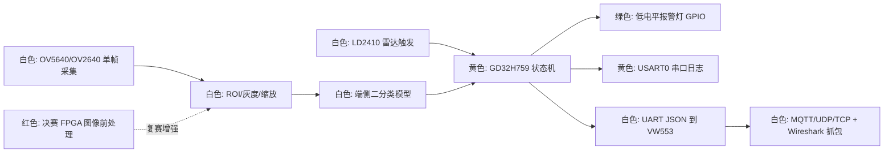

# EdgeCare 项目看板

更新时间：2026-06-07

## 本轮更新记录

- 2026-06-07：模块化重构第六步完成：新增 `app/edgecare_app.c/.h`，把 `edgecare_context_t`、状态枚举、启动 probe、预处理 probe、报警封装和主循环 step 从 `main.c` 移出；`main.c` 现在只负责 cache/SysTick/USART 初始化和 app loop。
- 2026-06-07：`main.c` 已降到 `48` 行，`edgecare_app.c` 为 `130` 行；Keil 工程已加入 `edgecare_app.c`，`build_keil.ps1` 编译通过：`0 Error(s), 0 Warning(s)`，程序大小 `Code=18366 RO-data=3190 RW-data=8 ZI-data=167000`。
- 2026-06-07：开发流程进阶：新增 `tools/verify_edgecare.ps1` 和 VS Code 任务 `Project: Verify EdgeCare`，用于提交前串起 `git diff --check`、安全扫描、Keil build 和 `build-keil.log` 成功检查。
- 2026-06-07：已实测 `tools/verify_edgecare.ps1` 通过：`git diff --check`、`git diff --cached --check`、安全扫描、Keil build 和日志成功检查全部通过。
- 2026-06-07：进入数据集闭环准备：新增默认关闭的 `EDGECARE_ENABLE_GRAY96_DUMP` 固件开关、`tools/collect_gray96_serial.py` 采集脚本和 `doc/EdgeCare_Data_Collection.md`，用于把 H7 端 `96x96` 灰度模型输入保存为 PC 端 PGM 样本。
- 2026-06-07：已验证采集链路基础能力：`collect_gray96_serial.py` 通过 `py_compile`，并能从模拟 `gray96_dump_*` 日志保存 PGM；默认关闭 dump 时 `tools/verify_edgecare.ps1` 仍通过 Keil `0 Error(s), 0 Warning(s)`。
- 2026-06-07：模块化重构第五步完成：新增 `bsp/bsp_camera_ov5640.c/.h`，把 OV5640 SCCB ID、QVGA/YUV 初始化、DVP GPIO 活动探测、DCI/DMA 单帧采集和帧缓冲从 `main.c` 移出；`main.c` 通过 `bsp_camera_ov5640_frame()` 取得最新 YUYV 帧给预处理模块使用。
- 2026-06-07：摄像头重构后 `main.c` 从约 `811` 行降到 `186` 行；`build_keil.ps1` 编译通过：`0 Error(s), 0 Warning(s)`，程序大小 `Code=18342 RO-data=3190 RW-data=8 ZI-data=167000`。
- 2026-06-07：模块化重构第四步完成：新增 `model/edgecare_infer.c/.h`，把当前 `stat_placeholder` 推理接口和 `edgecare_infer_result_t` 从 `main.c` 移出；日志仍明确标注 `model=stat_placeholder`，避免误认为已接入真实模型。
- 2026-06-07：Keil 工程已加入 `edgecare_infer.c`；`build_keil.ps1` 编译通过：`0 Error(s), 0 Warning(s)`，程序大小 `Code=18326 RO-data=3190 RW-data=8 ZI-data=167000`。
- 2026-06-07：模块化重构第三步完成：新增 `vision/edgecare_preprocess.c/.h`，把 QVGA `YUYV -> gray96` 最近邻缩放、Y 分量读取和 `min/max/mean/checksum/center` 统计从 `main.c` 移出；placeholder 推理接口暂时不动。
- 2026-06-07：Keil 工程已加入 `edgecare_preprocess.c`；`build_keil.ps1` 编译通过：`0 Error(s), 0 Warning(s)`，程序大小 `Code=18326 RO-data=3190 RW-data=8 ZI-data=167000`。
- 2026-06-07：模块化重构第二步完成：新增 `platform/edgecare_log.c/.h`，周期性状态日志格式从 `main.c` 移出；`main.c` 只传入状态名、雷达、推理耗时、置信度、报警和序号。
- 2026-06-07：Keil 工程已加入 `edgecare_log.c`；`build_keil.ps1` 编译通过：`0 Error(s), 0 Warning(s)`，程序大小 `Code=18246 RO-data=3190 RW-data=8 ZI-data=167000`。
- 2026-06-07：模块化重构第一步完成：新增 `board/board_config.h` 集中管理硬件常量，新增 `bsp/bsp_alarm.c/.h` 和 `bsp/bsp_radar_ld2410.c/.h`，`main.c` 不再直接保存报警灯/雷达 GPIO 宏和底层 GPIO 操作。
- 2026-06-07：Keil 工程已加入 `bsp_alarm.c`、`bsp_radar_ld2410.c`；`build_keil.ps1` 编译通过：`0 Error(s), 0 Warning(s)`，程序大小 `Code=18182 RO-data=3190 RW-data=8 ZI-data=167000`。
- 2026-06-07：README 已从“修改 `main.c` 中的引脚宏”改为指向 `board/board_config.h`，后续接线变更不再往 `main.c` 塞硬件配置。
- 2026-06-07：确认英文项目目录此前没有 Git 仓库；已初始化本地 Git 仓库，默认分支 `main`，并建立重构前基线提交 `chore: initialize EdgeCare firmware baseline`。
- 2026-06-07：已从 `main` 基线切出重构分支 `feature/firmware-module-refactor`；后续模块化重构在该分支上进行，`main` 保持可编译基线。
- 2026-06-07：新增 `.gitignore` 与 `.gitattributes`；版本管理采用白名单思路，跟踪 EdgeCare 源码、Keil 工程、脚本和轻量项目文档，忽略 SDK、PDF/压缩包、Keil `Objects/Listings`、`.uvoptx/.uvguix`、数据集和模型权重。
- 2026-06-07：提交前检查已通过：`git diff --check --cached` 无输出，`git_safety_scan.ps1` 未发现风险文件，Keil 命令行编译仍为 `0 Error(s), 0 Warning(s)`。
- 2026-06-07：进入“代码和开发流程规范化”阶段；已安装第三方 Codex skills：`keil`、`serial`、`workflow`，并新增项目级 skill `edgecare-gd32h759-firmware`。
- 2026-06-07：新增 `AGENTS.md`、`CODING_STYLE.md`、`doc/EdgeCare_Development_Workflow.md`、`.embeddedskills/config.json` 和 `.vscode/tasks.json`，把 VS Code + Codex + Keil 的编译/日志/重构规则固化到项目。
- 2026-06-07：规范化文件加入后重新运行 `build_keil.ps1`，Keil 命令行编译通过：`0 Error(s), 0 Warning(s)`，程序大小保持 `Code=18158 RO-data=3190 RW-data=8 ZI-data=167000`。
- 2026-06-07：用户实测串口已稳定输出 `camera_id: ov5640_regs[0x300A,0x300B]=0x56 0x40`，确认 OV5640 SCCB 链路可用。
- 2026-06-07：当前固件已加入 Day 3 DCI/DMA 单次采集诊断：启动时会打印 `camera_capture_probe:`、`camera_dvp:` 和一行 `camera_capture:`，随后继续周期性 `state=...`，避免 DVP 接错时卡死。
- 2026-06-07：`doc/EdgeCare_Camera_Bringup_Notes.md` 和 `doc/EdgeCare_Hardware_Pinout.md` 已补充 DCI 诊断输出解释；`PA6` 作为 `PCLK` 时可能与 START 板 LED2 冲突，若采集超时优先排查。
- 2026-06-07：用户回传最新日志：`camera_capture: dma=timeout ... hs0=0 vs0=0 hs1=0 vs1=0 fv=0 ef=0 ... dmaerr=000`。结论：SCCB 可读但 H7 未看到任何 `PCLK/HREF/SYNC` 活动，问题集中在 OV5640 未进入 DVP stream、物理 DVP 线/时钟、或 `PA6` PCLK 引脚冲突。
- 2026-06-07：固件已加入 OV5640 QVGA/YUV 最小 stream 初始化和 DCI 前 `camera_dvp_gpio:` 跳变计数。下一次日志可区分“相机没有吐时钟”和“DCI/DMA 接收配置问题”。Keil 命令行编译通过：`0 Error(s), 0 Warning(s)`。
- 2026-06-07：用户回传初始化后日志：`camera_init: readback 3008=0x02 size=320x240` 且 `pclk_edges=83558`，说明 OV5640 已接收 stream 命令并开始输出 PCLK；但 `href_edges=0 sync_edges=0`、DCI 仍 `dma=timeout`，当前焦点收敛到 HREF/SYNC 物理线、采样窗口、同步极性/映射或初始化表仍不完整。
- 2026-06-07：固件继续增强：补入 OV5640 官方 VGA preview 表中的关键时序/子采样/曝光窗口寄存器，把 DCI timeout 从 `12000000` 增至 `60000000`，并把 `camera_dvp_gpio` 改为 80 个长 burst 采样且输出 `href_high/sync_high`。Keil 命令行编译通过：`0 Error(s), 0 Warning(s)`。
- 2026-06-07：用户回传增强后日志：`pclk_edges=1433008 href_edges=11400 sync_edges=46 href_high=302634 sync_high=7513`，确认 `PCLK/HREF/SYNC` 三根 DVP 时序线都已经进入 H7。`camera_capture` 仍 `dma=timeout` 且 `fv/ef/vsif/elif=0`，当前焦点转为 DCI 同步极性或 DCI/DMA 配置。
- 2026-06-07：固件已改为一次启动自动尝试 4 组 DCI HS/VS blanking polarity：`hs_blank_low_vs_blank_low`、`hs_blank_low_vs_blank_high`、`hs_blank_high_vs_blank_low`、`hs_blank_high_vs_blank_high`，每组打印一行 `camera_capture[...]`。Keil 命令行编译通过：`0 Error(s), 0 Warning(s)`。
- 2026-06-07：用户回传 polarity 测试日志：`hs_blank_low_vs_blank_high`、`hs_blank_high_vs_blank_low`、`hs_blank_high_vs_blank_high` 都能 `dma=done`，其中 `hs_blank_low_vs_blank_high` 首部数据有自然变化，另外两组近似常数。当前判定工作极性为 `HS blanking low + VS blanking high`。
- 2026-06-07：固件已冻结工作极性，取消 4 组轮询，帧缓冲扩展为完整 `320x240 YUV422`，即 `153600 bytes / 38400 words`；新增 `first/mid/last` 样本和 `repeated` 统计。Keil 命令行编译通过：`0 Error(s), 0 Warning(s)`，程序大小 `ZI-data=157776`。
- 2026-06-07：用户回传完整帧日志：`dma=done words=38400 nonzero=38400 repeated=743 checksum=0x60A6DCA5`，`first/mid/last` 均为非零且非整段常数。结论：OV5640 -> DCI -> DMA 完整 QVGA 帧采集链路已打通。
- 2026-06-07：固件已加入 Day 4 最小预处理：从 YUYV 帧提取 Y 通道并最近邻缩放到 `96x96` 灰度模型输入 buffer，输出 `preprocess_gray96` 的 `min/max/mean/checksum/center`。Keil 命令行编译通过：`0 Error(s), 0 Warning(s)`，程序大小 `ZI-data=167000`。
- 2026-06-07：用户回传两次预处理日志，较亮场景 `mean=105 max=195 checksum=0x6A6150A4`，较暗场景 `mean=49 max=135 checksum=0x9FA4404E`，说明 `96x96` 模型输入会随场景变化，Y 通道提取方向可用。
- 2026-06-07：固件新增 `edgecare_infer()` 接口，当前实现为 `stat_placeholder`：基于 `gray96` 的均值/对比度输出临时 `confidence/intrusion`，只用于证明接口和日志链路，后续必须替换为 PC 训练的小 CNN / HOG-SVM / 传统 ML。Keil 命令行编译通过：`0 Error(s), 0 Warning(s)`。

下一步用户动作：可以在 VS Code 里用 `Ctrl+Shift+B` 验证 Keil 编译；若要让新安装的 skills 自动出现在 Codex 可用列表中，重启 Codex/开启新会话。硬件侧继续用 Keil 烧录当前 workspace 最新构建，打开 Serial Monitor 后按 RESET，回传 `preprocess_gray96: ...` 和 `infer_probe: ...`；随后开始按固定机位采集 `empty/safe` 与 `intrusion` 样本，至少每类 100 张或等价的灰度特征记录。

## 当前中心任务

15 天内完成 `EdgeCare_GD32_Industrial_Violation_Terminal` 初赛可演示版本：以 GD32H759 为核心，在端侧完成危险区域闯入检测、声光报警、结构化告警上传和隐私抓包证明。

当前主线已锁定：
- 赛题：兆易创新 Endpoint AI / 边缘 AI 电子系统设计。
- MVP：固定机位危险区 ROI，二分类 `safe/empty` vs `intrusion`。
- 当前人力：A/B 工作暂时都由用户一人承担；Codex 负责工程代码、文档、看板和调试辅助。
- 初赛非目标：不做 YOLO、多目标识别、音频主线、FPGA 主线，不让电脑/手机承担核心推理。

## 当前可演示版本

- 可演示功能：GD32H759 Keil 工程可编译；LD2410 触发、报警灯 GPIO、USART0 日志、OV5640 QVGA YUV422 采集、`96x96` 灰度预处理、默认关闭的 gray96 样本转储和 placeholder 推理接口已打通。
- 工程路径：`D:\MyProject\GRADUATE ELECTONICS DESIGN CONTEST\EdgeCare_GD32_Industrial_Violation_Terminal`
- Keil 工程：`GD32H759I_START_Demo_Suites\Projects\01_EdgeCare_Industrial_Violation_Terminal\MDK-ARM\EdgeCare_GD32_Terminal.uvprojx`
- VS Code 默认构建任务：`Keil: Build EdgeCare GD32H759I-START`，可通过 `Ctrl+Shift+B` 调用。
- VS Code 提交前验证任务：`Project: Verify EdgeCare`，用于串起 Git 检查、安全扫描和 Keil build。
- 项目规范入口：`AGENTS.md`、`CODING_STYLE.md`、`doc/EdgeCare_Development_Workflow.md`。
- 数据采集入口：`doc/EdgeCare_Data_Collection.md`，PC 端脚本为 `tools/collect_gray96_serial.py`。
- 当前重构状态：`board_config`、`bsp_alarm`、`bsp_radar_ld2410`、`bsp_camera_ov5640`、`edgecare_log`、`edgecare_preprocess`、`edgecare_infer`、`edgecare_app` 已抽出并编译通过。
- 编译命令：

```powershell
cd "D:\MyProject\GRADUATE ELECTONICS DESIGN CONTEST\EdgeCare_GD32_Industrial_Violation_Terminal"
powershell -ExecutionPolicy Bypass -File .\build_keil.ps1
```

一键验证：

```powershell
cd "D:\MyProject\GRADUATE ELECTONICS DESIGN CONTEST"
powershell -ExecutionPolicy Bypass -File .\tools\verify_edgecare.ps1
```

- 串口日志目标格式：`[ts_ms] state=... radar=... infer_ms=... conf=... alarm=... seq=...`
- H7 -> VW553 目标 JSON：`{"dev":"edgecare-01","event":"zone_intrusion","conf":0.87,"lat_ms":132,"seq":42}`

## 项目蓝图

- Day 1-2：硬件基线、报警灯、串口日志、LD2410 触发状态机。
- Day 3-4：摄像头单帧采集、ROI 裁剪、缩放、数据集闭环。
- Day 5-8：模型路线决策、端侧推理、多帧投票、误报抑制。
- Day 9-10：VW553 结构化告警上传、Wireshark 抓包演示。
- Day 11-12：稳定性指标、OLED/串口状态页、工程化增强。
- Day 13-15：功能冻结、论文/PPT/视频、提交检查。

## 架构图

颜色说明：
- 绿色：已完成或已验证
- 黄色：正在攻关
- 白色：计划中
- 红色：保底或暂缓



## 当前状态

### 已完成

- [x] 2026 研电赛资料与硬件资料整理到 `doc/`。
- [x] 赛题方向锁定为兆易创新 Endpoint AI。
- [x] 初赛主线从旧的设备健康监测切换为 EdgeCare 工业危险区闯入检测。
- [x] 新英文根目录与 EdgeCare Keil 工程已建立。
- [x] `EdgeCare_GD32_Terminal` 在 Keil 命令行下编译通过。
- [x] 报警灯默认使用 `PA8`，低电平点亮。
- [x] Day 1 状态机骨架和串口日志已加入 `main.c`。
- [x] 2026-06-06 21:15 编译验证通过：`0 Error(s), 0 Warning(s)`。
- [x] 2026-06-07：README 已补充 USB-TTL 直连 USART0 的接线、Serial Monitor 参数和乱码排查顺序。
- [x] 2026-06-07：确认实际板卡为 `GD32H759I-START`；从兆易 START 官方 demo 解包并确认 START 串口为 `USART0 PF4/PF5 AF4`，已修正工程板级串口定义。
- [x] 2026-06-07：修正后 Keil 命令行编译通过：`0 Error(s), 0 Warning(s)`。
- [x] 2026-06-07：用户确认 USB-TTL 已能看到周期性 `state=...` 日志，Day 1 串口日志链路打通。
- [x] 2026-06-07：板级文件命名从 `gd32h759i_eval.*` 改为 `gd32h759i_start.*`，Keil 工程组改为 `GD32H7xx_START`，README/build 脚本路径改为 `GD32H759I_START_Demo_Suites`。
- [x] 2026-06-07：正式 `build_keil.ps1` 编译验证通过：`0 Error(s), 0 Warning(s)`，构建日志显示 `compiling gd32h759i_start.c`。
- [x] 2026-06-07：关闭 Keil 后已移除临时目录联接，并将实体目录从 `GD32H759I_EVAL_Demo_Suites` 改为 `GD32H759I_START_Demo_Suites`。
- [x] 2026-06-07：实体目录重命名后再次运行 `build_keil.ps1`，验证通过：`0 Error(s), 0 Warning(s)`。
- [x] 2026-06-07：Day 2 LD2410 三线 GPIO 触发固件已加入：`V/G/O` 中 `O` 默认接 `PF8`，`radar=1` 时报警灯 `PA8` 拉低点亮；`build_keil.ps1` 验证通过：`0 Error(s), 0 Warning(s)`。
- [x] 2026-06-07：已访问海凌科 `HLK-LD2410B-24G` 官方下载页并下载关键资料到 `doc/hardware_manuals/HLK_LD2410B_official/`：说明书、串口协议、天线罩设计、底噪功能说明、上位机工具、APP 下载说明和 Arduino 库参考。
- [x] 2026-06-07：用户验证 `PF8` 链路正常：接 `O` 时日志为 `state=ALARM radar=1 alarm=1`，拔掉 `PF8` 后日志为 `state=IDLE radar=0 alarm=0`；当前常响根因集中在 LD2410 `O` 持续为高或雷达无人持续时间/探测参数。
- [x] 2026-06-07：查阅官方 `LD2410B 串口通信协议 V1.08.pdf`：`OUT` 有人高、无人低；“无人持续时间”决定从有人变无人前的保持时间，范围 `0-65535 s`，协议示例为 `5 s`。当前固件自身不增加保持时间，`PF8` 轮询周期为 `500 ms`。
- [x] 2026-06-07：新增 `tools/ld2410_set_no_person_duration.py`，可通过 USB-TTL 临时连接 LD2410 UART，把“无人持续时间”写成 `1-2 s`；`--dry-run` 协议帧和 `py_compile` 已验证。
- [x] 2026-06-07：用户已用 `HLKRadarToolAPP` 将 LD2410 “无人持续时间”设为 `1 s`，雷达触发/释放效果已明显改善，可用于初赛演示的低功耗触发前级。
- [x] 2026-06-07：已把 LD2410 检测范围和参考文档写入 README：官方说明书第 3/7/17 页说明 `0.75m-6m`、约 `±60°`、距离分辨率 `0.75m`、`OUT` 高=有人；协议第 5/9 页说明距离门/灵敏度/无人持续时间。
- [x] 2026-06-07：新增 `doc/EdgeCare_Hardware_Pinout.md`，记录 USART0 `PF4/PF5`、报警灯 `PA8`、LD2410 `O->PF8` 和后续摄像头/VW553 待定引脚。
- [x] 2026-06-07：已定位 Day 3 摄像头参考源：`doc/GD32EmbeddedAI_V1.2.0.39432/AI_Demo/GD32H759I-EVAL-Camera-Object-Dection/DCI_OV2640_gesture_release.rar` 内含 DCI/OV2640 示例工程，可作为最小采集移植参考。
- [x] 2026-06-07：已解包 OV2640/DCI 示例到 `doc/extracted_camera_examples/DCI_OV2640_gesture_release/`，并新增 `doc/EdgeCare_Camera_Bringup_Notes.md`；已识别参考例程使用 `PA8/CKOUT0` 输出摄像头时钟，与当前报警灯 `PA8` 冲突。

### 正在做

- [x] Day 1：使用 USB-TTL 直接连接 `GD32H759I-START` 的 USART0 `PF4/PF5`，通过 VS Code Serial Monitor 验证日志。
- [x] Day 1：COM8 乱码根因确认为旧工程按 EVAL 板 `PA9/PA10` 接线；切换到 START 板 `PF4/PF5` 后已看到周期性状态日志。
- [x] Day 2：接入 LD2410，优先采用 GPIO 触发方式，先实现“有人触发 -> 状态变化 -> 报警/日志”的闭环固件。
- [x] Day 2：用户已接入 LD2410 `V/G/O`，并用 HLK APP 将“无人持续时间”调到 `1 s`；雷达触发链路当前可用。
- [x] Day 2：整理 H7、报警灯、LD2410、摄像头、VW553 引脚表；已新增 `doc/EdgeCare_Hardware_Pinout.md`，摄像头/VW553 引脚仍待硬件确认。
- [ ] Day 2：用户已确认 LD2410 转接板有 `V/G/O` 焊盘，下一步按 `VCC/GND/OUT` 三线 GPIO 触发方案接入；接 `PF8` 前先用万用表确认 `O` 输出不超过 3.3V。
- [x] Day 3：解包并阅读 `DCI_OV2640_gesture_release.rar`，提取 DCI GPIO、I2C/SCCB、DMA、帧缓存和 OV2640 初始化代码；若用户硬件是 OV5640，则只复用 DCI/DMA 框架。
- [ ] Day 3：确认摄像头型号和排针丝印；若摄像头需要 `PA8/CKOUT0`，先迁移报警灯引脚或在摄像头 bring-up 阶段临时断开报警灯。

### 阻塞

- [ ] 未确认报警灯 `IN` 最终是否接 `PA8`。
- [ ] 启动日志 `edgecare-01 boot...` 只在复位后打印一次；若 Serial Monitor 打开较晚会错过，打开串口后按板子 RESET 可复现。
- [ ] 未确认 LD2410 `O` 高电平是否已用万用表实测为 3.3V；官方资料写 IO 电平 3.3V，但实物仍建议记录一次测量结果。
- [x] 摄像头照片已确认是 OV5640 类 DVP 并口模块；最终传感器型号仍以 SCCB 读 ID 为准。
- [x] 已从 `doc/hardware_manuals/GD32H759I_START_Demo_Suites/Docs/Schematic/GD32H759I-START-V1.5.pdf` 确认 START 板排针引出了可用 DCI 引脚组合；`PH4` 未引出，SCCB 改用 `PB10/PB11`。
- [x] 已在 `main.c` 加入 OV5640/OV2640 SCCB ID 启动探测：`PB10/PB11`，`RES=PD0`，`PWON=PD1`；失败不阻塞雷达/报警状态机。
- [x] 2026-06-07：`build_keil.ps1` 编译通过，`0 Error(s), 0 Warning(s)`。
- [x] 2026-06-07：用户实测串口输出 `camera_id: ov5640_regs[0x300A,0x300B]=0x56 0x40`，确认 OV5640 SCCB 链路和 `PB10/PB11 + PD0/PD1` 控制线可用。
- [x] 2026-06-07：固件已改为 OV5640 确认后跳过 OV2640 备用 ID 输出，避免 `0x00 0x00` 误导；重新编译通过，`0 Error(s), 0 Warning(s)`。
- [ ] 摄像头参考例程使用 `PA8/CKOUT0` 作为 `XCLK/MCLK`，当前报警灯也在 `PA8`；进入摄像头前必须解决该引脚冲突。
- [ ] 未确认 VW553 初版上传链路选 MQTT、UDP 还是 TCP。

### 待办

- [x] 烧录并实测 LD2410 `O -> PF8` 触发输入是否能稳定接入状态机。
- [ ] 跑通摄像头 DCMI 单帧采集。
- [ ] 实现 ROI 裁剪、灰度化和 `96x96`/`128x128` 缩放。
- [x] 建立危险区闯入 gray96 数据采集入口和标注规范：`doc/EdgeCare_Data_Collection.md`、`tools/collect_gray96_serial.py`。
- [ ] 训练并选择小 CNN INT8 或 HOG/SVM 保底模型。
- [ ] 集成 `edgecare_infer(input, output)` 到 H7。
- [ ] 实现多帧投票和 `conf >= 0.75` 默认阈值。
- [ ] 实现 H7 -> VW553 UART JSON。
- [ ] 形成 Wireshark 抓包演示材料和指标表。

## 你现在需要做什么

- [ ] 在 VS Code 中按 `Ctrl+Shift+B`，确认默认任务能运行 Keil 编译。
- [ ] 需要使用新装 `keil/serial/workflow/edgecare-gd32h759-firmware` skills 时，重启 Codex 或开启新会话。
- [ ] 打开 VS Code Serial Monitor 后按板子 RESET，确认能看到一次性启动日志 `edgecare-01 boot...`。
- [x] 确认并告诉 Codex 当前摄像头模块型号和接口排针丝印：照片显示 OV5640 类 DVP 模块，含 `D0-D7/PCLK/SYNC/HREF/SCL/SDA/RES/PWON/3V3/GND`。
- [x] 对照 `doc/EdgeCare_Hardware_Pinout.md` 的 DCI 候选表，确认 START 板排针上能找到主要 DCI 引脚；`PC9` 因连接 LED1 不作为首选，`D3` 改用 `PG11`。
- [x] 先按 `PB10/PB11 + PD0/PD1 + 3V3/GND` 接相机最小 SCCB 测试线，暂不接满 DVP 数据总线。
- [x] 烧录后打开 Serial Monitor，复位板子，检查是否出现 `camera_id: ov5640_regs[0x300A,0x300B]=0x56 0x40` 或 timeout/no ack。
- [x] 下一步按 `doc/EdgeCare_Hardware_Pinout.md` 接满 OV5640 DVP 总线：`D0-D7/PCLK/HREF/SYNC`，然后实现 DCI/DMA 单帧采集。
- [ ] 固定相机机位，开始记录 `empty/safe` 和 `intrusion` 两类样本场景。
- [ ] 把实际硬件接线记录下来：报警灯、LD2410、摄像头、VW553；已确认的内容可对照 `doc/EdgeCare_Hardware_Pinout.md`。

## Codex 下一步要做什么

- [ ] 每次改代码前后同步更新本看板。
- [x] 初始化本地 Git 仓库，建立重构前基线提交。
- [x] 建立 `.gitignore`/`.gitattributes`，避免提交 SDK、PDF、压缩包、Keil 产物、数据集和模型权重。
- [x] 重构前创建短分支 `feature/firmware-module-refactor`，不要直接在 `main` 上连续改大块代码。
- [x] 抽出 `board_config.h`、`bsp_alarm`、`bsp_radar_ld2410`，并确认 Keil 编译通过。
- [x] 抽出 `edgecare_log`，把固定周期日志格式从 `main.c` 移到 `platform/edgecare_log.c/.h`。
- [x] 抽出 `vision/edgecare_preprocess`，只搬 `YUYV -> gray96` 和 `preprocess_gray96` 统计计算，不改模型接口。
- [x] 抽出 `model/edgecare_infer`，保留 `stat_placeholder` 标记，后续再替换为训练模型。
- [x] 抽出摄像头模块边界：SCCB/OV5640/DCI/DMA 相关代码已进入 `bsp_camera_ov5640`，启动 probe 日志保持不变。
- [x] 抽出 `app/edgecare_app`，把 `edgecare_context_t`、状态机和主循环 step 从 `main.c` 移出，使 `main.c` 接近 init + loop。
- [x] 安装 `zhinkgit/embeddedskills` 的 `keil`、`serial`、`workflow` skills。
- [x] 新增项目级 `edgecare-gd32h759-firmware` skill，并通过 `quick_validate.py` 验证。
- [x] 新增项目规范与开发流程文档：`AGENTS.md`、`CODING_STYLE.md`、`doc/EdgeCare_Development_Workflow.md`。
- [x] 本轮模块化重构按 `board_config` -> `bsp_alarm` -> `bsp_radar_ld2410` -> `edgecare_log` -> `edgecare_preprocess` -> `edgecare_infer` -> `bsp_camera_ov5640` -> `edgecare_app` 完成，并保持 Keil 编译通过。
- [x] 提取并阅读 GD32 Embedded AI 的 DCI OV2640 示例，准备 Day 3 摄像头最小采集移植路线。
- [ ] 根据用户反馈的摄像头型号和实际接线，把 DCI/SCCB 引脚配置固化到工程文档。

## Git 与 GitHub 状态

- 本地路径：`D:\MyProject\GRADUATE ELECTONICS DESIGN CONTEST`
- 当前状态：已初始化 Git 仓库。
- 当前分支：`feature/firmware-module-refactor`
- 远端仓库：未配置。
- 重构前基线提交：`chore: initialize EdgeCare firmware baseline`
- 版本管理策略：`main` 保留可编译基线；模块化重构在 `feature/firmware-module-refactor` 上进行，完成一小步并通过 Keil 编译后提交。

## 运行与测试命令

VS Code：

```text
Ctrl+Shift+B -> Keil: Build EdgeCare GD32H759I-START
```

命令行：

```powershell
cd "D:\MyProject\GRADUATE ELECTONICS DESIGN CONTEST\EdgeCare_GD32_Industrial_Violation_Terminal"
powershell -ExecutionPolicy Bypass -File .\build_keil.ps1
```

## 安全与禁止提交清单

- [ ] 不提交 `.env`、API key、token、私钥、证书。
- [ ] 不提交 SDK 包、模型权重、APK、视频、原始大数据集。
- [ ] 不提交 Keil `Objects/`、`Listings/`、日志和临时缓存。
- [ ] 如初始化 Git，先建立 `.gitignore`。

## 关键决策记录

- 2026-06-07：重构前必须先有本地 Git 基线；本项目只把源码、Keil 工程、脚本和轻量说明纳入版本管理，下载资料、SDK、模型、数据集和构建产物留在工作区但不提交。
- 2026-06-07：模块化重构采用小步提交；第一步只抽硬件配置、报警灯 BSP 和 LD2410 BSP，不改变状态机、摄像头、预处理或推理逻辑。
- 2026-06-07：开发流程采用“VS Code/Codex 写代码 + Keil 编译下载调试”的稳定路线；当前只自动化编译和日志读取，不自动烧录，避免 GDLink/OpenOCD flash 路径不确定影响进度。
- 2026-06-07：采用 `zhinkgit/embeddedskills` 解决 Keil/serial/workflow 工具链问题，同时自建 `edgecare-gd32h759-firmware` 项目级 skill 和 `CODING_STYLE.md` 解决本项目代码结构问题。
- 2026-06-07：后续重构顺序冻结为 `board_config` -> `bsp_alarm` -> `bsp_radar_ld2410` -> `edgecare_log` -> `edgecare_preprocess` -> `edgecare_infer` -> `bsp_camera_ov5640` -> `edgecare_app`，每一步都必须可编译。
- 2026-06-07：摄像头照片已确认是 OV5640 类 DVP 并口模块，排针包含 `PWDN/PCLK/D0-D7/SDA/SCL/HREF/VSYNC/RES/3V3/GND`；当前决策是不先盲接全总线，先确认 `GD32H759I-START` 侧 DCI 引脚是否引出，再做 SCCB/I2C 读 ID。
- 2026-06-07：已读取 START 原理图和用户手册，确认 `PH4` 未引出，SCCB 改用 `PB10/PB11`；`PC9` 接板载 LED1，DCI_D3 推荐改用 `PG11`。
- 2026-06-07：相机 bring-up 路线冻结为先读 SCCB ID，不先接满 DVP 总线；ID 通过后再接 `D0-D7/PCLK/HREF/SYNC` 和启用 DCI/DMA。
- 2026-06-07：OV5640 ID 读取使用 16 位寄存器地址 `0x300A/0x300B`；OV2640 兼容探测使用 8 位寄存器地址 `0x0A/0x0B`。
- 2026-06-07：OV5640 SCCB ID 已由实物验证通过，Day 3 可以进入 DVP 并口 DCI/DMA bring-up。
- 2026-06-01：放弃小米相关赛题，转向兆易创新 Endpoint AI。
- 2026-06-01：FPGA 放到决赛增强，不作为初赛阻塞项。
- 2026-06-06：根目录切换到英文路径，避免中文路径影响 Keil/工具链。
- 2026-06-06：项目主线锁定为 `EdgeCare` 工厂危险区域闯入检测。
- 2026-06-06：初赛 MVP 采用固定机位 ROI 二分类，不做复杂目标检测。
- 2026-06-06：A/B 工作暂时都由用户一人承担。
- 2026-06-07：串口验证改用 USB-TTL 直接接 USART0；当前乱码先按波特率、PA9/PA10 接线、COM 口选择、固件烧录四项排查，不改固件。
- 2026-06-07：用户确认 `115200 8N1` 且只接两根线后仍乱码；新增怀疑项为当前工程按 `GD32H759I-EVAL` 的 25 MHz HXTAL/600 MHz PLL 配置运行，若实际板卡晶振不同会导致 UART 实际波特率偏移。
- 2026-06-07：用户确认板卡丝印为 `GD32H759I-START`，已从官方 START demo 确认用户串口不是 EVAL 的 `PA9/PA10`，而是 `USART0 PF4/PF5 AF4`；先修正串口引脚，不再优先怀疑 HXTAL。
- 2026-06-07：看到周期性 `state=...` 后，确认串口链路可用；`boot` 日志属于一次性复位输出，不进入周期日志。
- 2026-06-07：开始把工程命名从 EVAL 清理为 START；源码、Keil 工程引用、README、构建脚本和实体目录已完成，`build_keil.ps1` 验证通过。
